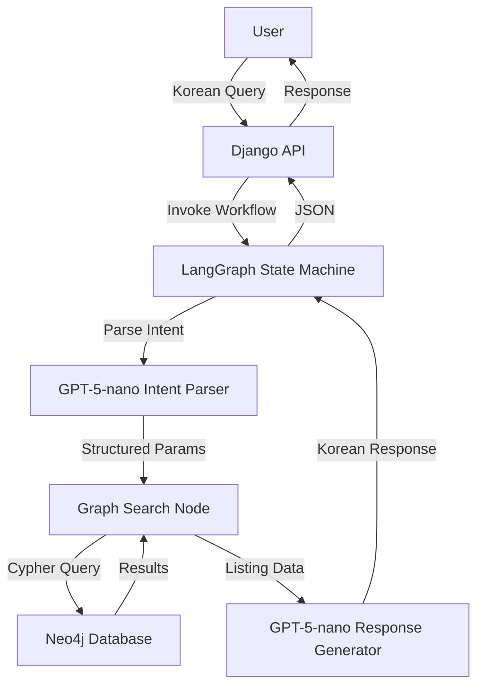

# Design Document: Neo4j Location-Based Chatbot

## Overview

This system implements a location-based real estate recommendation chatbot using Neo4j graph database, LangGraph workflow orchestration, and GPT-5-nano for natural language understanding and generation. The chatbot answers queries about listings near universities, hospitals, parks, commercial areas, and public transportation.

The architecture follows a three-layer approach:
1. **Data Layer**: Neo4j graph database storing listings and facilities with spatial relationships
2. **Logic Layer**: LangGraph workflow with intent parsing, graph querying, and response generation nodes
3. **API Layer**: Django REST endpoints exposing chatbot functionality

## Architecture

### High-Level Architecture

```
User Query (Korean)
    ↓
Django REST API (/api/chatbot/query)
    ↓
LangGraph Workflow
    ├─→ Intent Parser Node (GPT-5-nano)
    │   └─→ Extract: intent, facility_name, max_distance, facility_type
    ├─→ Graph Search Node (Neo4j Cypher)
    │   └─→ Execute distance queries, aggregate facilities
    └─→ Response Generator Node (GPT-5-nano)
        └─→ Format results in natural Korean
    ↓
JSON Response with listings + explanation
```

### Component Interaction Flow



## Components and Interfaces

### 1. Neo4j Graph Database

**Node Types:**

```cypher
// Listing Node
(:Listing {
  listing_id: string,
  title: string,
  address: string,
  location: point,  // {latitude, longitude}
  deposit: integer,
  rent: integer,
  area_m2: float,
  building_type: string,  // "원룸", "오피스텔", "아파트", etc.
  floor: integer
})

// University Node
(:University {
  univ_id: string,
  name: string,
  campus_name: string,
  address: string,
  location: point
})

// Hospital Node
(:Hospital {
  hospital_id: string,
  name: string,
  type: string,  // "병원", "의원", "약국"
  address: string,
  location: point
})

// Park Node
(:Park {
  park_id: string,
  name: string,
  area_m2: float,
  address: string,
  location: point
})

// CommercialFacility Node
(:CommercialFacility {
  facility_id: string,
  name: string,
  business_type_code: string,
  business_type_name: string,  // "편의점", "음식점", etc.
  address: string,
  location: point
})

// BusStop Node
(:BusStop {
  stop_id: string,
  name: string,
  address: string,
  location: point
})

// SubwayStation Node
(:SubwayStation {
  station_id: string,
  name: string,
  line: string,
  address: string,
  location: point
})
```

**Relationship Types:**

```cypher
// Optional pre-computed relationships for performance
(:Listing)-[:NEAR {distance_m: float}]->(:University)
(:Listing)-[:NEAR {distance_m: float}]->(:Hospital)
(:Listing)-[:NEAR {distance_m: float}]->(:Park)
(:Listing)-[:NEAR {distance_m: float}]->(:CommercialFacility)
(:Listing)-[:NEAR {distance_m: float}]->(:BusStop)
(:Listing)-[:NEAR {distance_m: float}]->(:SubwayStation)
```

**Spatial Indexes:**

```cypher
CREATE INDEX listing_location FOR (l:Listing) ON (l.location);
CREATE INDEX university_location FOR (u:University) ON (u.location);
CREATE INDEX hospital_location FOR (h:Hospital) ON (h.location);
CREATE INDEX park_location FOR (p:Park) ON (p.location);
CREATE INDEX commercial_location FOR (c:CommercialFacility) ON (c.location);
CREATE INDEX bus_location FOR (b:BusStop) ON (b.location);
CREATE INDEX subway_location FOR (s:SubwayStation) ON (s.location);
```

### 2. LangGraph Workflow State

```python
from typing import TypedDict, List, Optional, Dict, Any

class ChatbotState(TypedDict):
    # Input
    question: str
    
    # Intent parsing results
    intent: Optional[str]  # "university_proximity", "hospital_proximity", etc.
    facility_name: Optional[str]  # e.g., "중앙대학교"
    facility_type: Optional[str]  # e.g., "university", "hospital"
    max_distance_m: Optional[int]  # converted from time or direct distance
    max_time_minutes: Optional[int]  # original time constraint
    
    # Graph query results
    listings: Optional[List[Dict[str, Any]]]
    facility_counts: Optional[Dict[str, int]]  # for commercial density queries
    
    # Response generation
    answer: Optional[str]
    
    # Error handling
    error: Optional[str]
    needs_clarification: Optional[bool]
```

### 3. Intent Parser Node

**Interface:**

```python
def parse_intent(state: ChatbotState) -> ChatbotState:
    """
    Uses GPT-5-nano to extract structured parameters from user query.
    
    Input: state["question"]
    Output: Updates state with intent, facility_name, facility_type, max_distance_m
    """
```

**GPT-5-nano Prompt Template:**

```python
INTENT_PARSER_PROMPT = """
You are an intent parser for a real estate chatbot. Extract structured information from the user's Korean query.

User Query: {question}

Extract the following information:
1. intent: One of [university_proximity, hospital_proximity, park_proximity, commercial_density, transportation_proximity, general_search]
2. facility_name: Specific facility name if mentioned (e.g., "중앙대학교")
3. facility_type: Type of facility [university, hospital, park, convenience_store, restaurant, bus, subway]
4. max_time_minutes: Time constraint in minutes if mentioned
5. max_distance_m: Distance in meters if mentioned directly

Conversion rules:
- Walking speed: 75 meters per minute
- "20분 거리" → max_time_minutes: 20, max_distance_m: 1500
- "도보 10분" → max_time_minutes: 10, max_distance_m: 750

Return JSON format:
{{
  "intent": "...",
  "facility_name": "...",
  "facility_type": "...",
  "max_time_minutes": ...,
  "max_distance_m": ...,
  "needs_clarification": false
}}

If the query is ambiguous, set needs_clarification to true.
"""
```

### 4. Graph Search Node

**Interface:**

```python
def search_graph(state: ChatbotState) -> ChatbotState:
    """
    Executes Neo4j Cypher queries based on parsed intent.
    
    Input: state["intent"], state["facility_name"], state["max_distance_m"]
    Output: Updates state["listings"] with query results
    """
```

**Query Templates by Intent:**

**University Proximity:**
```cypher
MATCH (u:University {name: $facility_name})
MATCH (l:Listing)
WHERE distance(u.location, l.location) <= $max_distance_m
RETURN 
  l.listing_id AS id,
  l.title AS title,
  l.address AS address,
  l.deposit AS deposit,
  l.rent AS rent,
  l.area_m2 AS area,
  l.building_type AS building_type,
  round(distance(u.location, l.location)) AS distance_m
ORDER BY distance_m ASC
LIMIT 20
```

**Hospital Proximity:**
```cypher
MATCH (l:Listing)
MATCH (h:Hospital)
WHERE distance(l.location, h.location) <= $max_distance_m
WITH l, collect({name: h.name, type: h.type, distance: round(distance(l.location, h.location))}) AS nearby_hospitals
WHERE size(nearby_hospitals) > 0
RETURN 
  l.listing_id AS id,
  l.title AS title,
  l.address AS address,
  l.deposit AS deposit,
  l.rent AS rent,
  nearby_hospitals,
  size(nearby_hospitals) AS hospital_count
ORDER BY hospital_count DESC, l.rent ASC
LIMIT 20
```

**Park Proximity:**
```cypher
MATCH (l:Listing)
MATCH (p:Park)
WHERE distance(l.location, p.location) <= $max_distance_m
WITH l, collect({name: p.name, area: p.area_m2, distance: round(distance(l.location, p.location))}) AS nearby_parks
WHERE size(nearby_parks) > 0
RETURN 
  l.listing_id AS id,
  l.title AS title,
  l.address AS address,
  l.deposit AS deposit,
  l.rent AS rent,
  nearby_parks,
  size(nearby_parks) AS park_count
ORDER BY park_count DESC
LIMIT 20
```

**Commercial Density:**
```cypher
MATCH (l:Listing)
MATCH (c:CommercialFacility)
WHERE distance(l.location, c.location) <= 300
  AND c.business_type_name IN ["편의점", "음식점", "카페", "슈퍼마켓"]
WITH l, 
     count(CASE WHEN c.business_type_name = "편의점" THEN 1 END) AS convenience_count,
     count(CASE WHEN c.business_type_name IN ["음식점", "카페"] THEN 1 END) AS food_count,
     count(*) AS total_count
WHERE total_count > 5
RETURN 
  l.listing_id AS id,
  l.title AS title,
  l.address AS address,
  l.deposit AS deposit,
  l.rent AS rent,
  convenience_count,
  food_count,
  total_count
ORDER BY total_count DESC
LIMIT 20
```

**Transportation Proximity:**
```cypher
MATCH (l:Listing)
OPTIONAL MATCH (s:SubwayStation)
WHERE distance(l.location, s.location) <= 800
WITH l, collect({name: s.name, line: s.line, distance: round(distance(l.location, s.location))}) AS nearby_subway
OPTIONAL MATCH (b:BusStop)
WHERE distance(l.location, b.location) <= 300
WITH l, nearby_subway, collect({name: b.name, distance: round(distance(l.location, b.location))}) AS nearby_bus
WHERE size(nearby_subway) > 0 OR size(nearby_bus) > 0
RETURN 
  l.listing_id AS id,
  l.title AS title,
  l.address AS address,
  l.deposit AS deposit,
  l.rent AS rent,
  nearby_subway,
  nearby_bus,
  size(nearby_subway) AS subway_count,
  size(nearby_bus) AS bus_count
ORDER BY subway_count DESC, bus_count DESC
LIMIT 20
```

### 5. Response Generator Node

**Interface:**

```python
def generate_response(state: ChatbotState) -> ChatbotState:
    """
    Uses GPT-5-nano to format query results into natural Korean response.
    
    Input: state["question"], state["listings"], state["intent"]
    Output: Updates state["answer"] with formatted response
    """
```

**GPT-5-nano Prompt Template:**

```python
RESPONSE_GENERATOR_PROMPT = """
You are a friendly Korean real estate assistant. Format the search results into a natural, helpful response.

User Query: {question}
Search Intent: {intent}
Results: {listings}

Instructions:
1. Summarize the top 5-10 listings
2. For each listing, include:
   - Title and address (district/neighborhood)
   - Deposit and monthly rent (보증금/월세)
   - Distance or facility count (depending on query type)
   - Key convenience factors
3. Use natural Korean language
4. Express distances in user-friendly terms (도보 X분, 약 Xm)
5. If no results, suggest alternative search criteria

Format as a conversational response, not a rigid list.
"""
```

## Data Models

### Data Import Pipeline

**Source Data Mapping:**

| Data Source | Node Type | Key Fields |
|------------|-----------|------------|
| data/landData/*.json | Listing | listing_id, title, address, lat, lon, deposit, rent, area_m2, building_type, floor |
| data/교육부_대학교 주소기반 좌표정보_20241030.xlsx | University | univ_id, name, campus_name, address, lat, lon |
| data/전국 병의원 및 약국 현황 2025.9/*.csv | Hospital | hospital_id, name, type, address, lat, lon |
| data/서울시_도시공원정보/*.csv | Park | park_id, name, area_m2, address, lat, lon |
| data/소상공인시장진흥공단_상가(상권)정보_20251030/*.csv | CommercialFacility | facility_id, name, business_type_code, business_type_name, address, lat, lon |
| data/국토교통부_전국 버스정류장 위치정보_20241031_utf8.csv | BusStop | stop_id, name, address, lat, lon |
| data/지하철_노선도.csv | SubwayStation | station_id, name, line, address, lat, lon |

**Import Script Structure:**

```python
# scripts/import_graph_data.py

def import_listings(driver, json_files):
    """Import listing data from data/landData/*.json"""
    
def import_universities(driver, excel_file):
    """Import university data from Excel"""
    
def import_hospitals(driver, csv_files):
    """Import hospital/pharmacy data from multiple CSVs"""
    
def import_parks(driver, csv_files):
    """Import park data from Seoul district CSVs"""
    
def import_commercial(driver, csv_file):
    """Import commercial facility data"""
    
def import_bus_stops(driver, csv_file):
    """Import bus stop data"""
    
def import_subway_stations(driver, csv_file):
    """Import subway station data"""
    
def create_spatial_indexes(driver):
    """Create spatial indexes on all location properties"""
```

## Cor
rectness Properties

*A property is a characteristic or behavior that should hold true across all valid executions of a system-essentially, a formal statement about what the system should do. Properties serve as the bridge between human-readable specifications and machine-verifiable correctness guarantees.*

### Property 1: Time to distance conversion accuracy
*For any* time duration in minutes, when converted to distance using walking speed (75 meters per minute), the result should equal time × 75 meters.
**Validates: Requirements 1.2, 6.3**

### Property 2: Distance query correctness
*For any* university and distance threshold, all returned listings should have a distance from the university less than or equal to the threshold, and no listings within the threshold should be excluded.
**Validates: Requirements 1.3**

### Property 3: Result ordering by distance
*For any* set of query results containing distance information, the results should be ordered in ascending order by distance.
**Validates: Requirements 1.4**

### Property 4: Response contains required fields
*For any* query result set, the formatted response should include title, address, deposit, rent, and distance information for each listing.
**Validates: Requirements 1.5**

### Property 5: Hospital proximity filtering
*For any* listing and hospital set, if a listing is returned in hospital proximity results, then at least one hospital should exist within 500 meters of that listing.
**Validates: Requirements 2.2**

### Property 6: Hospital count accuracy
*For any* listing in hospital proximity results, the reported count of nearby hospitals should equal the actual number of hospitals within 500 meters.
**Validates: Requirements 2.3**

### Property 7: Park proximity filtering
*For any* listing and park set, if a listing is returned in park proximity results, then at least one park should exist within 800 meters of that listing.
**Validates: Requirements 3.2**

### Property 8: Commercial facility distance filtering
*For any* listing and commercial facility set, all commercial facilities counted as "nearby" should be within 300 meters of the listing.
**Validates: Requirements 4.1**

### Property 9: Commercial facility count accuracy
*For any* listing, the reported count of nearby convenience stores and restaurants should equal the actual number of such facilities within 300 meters.
**Validates: Requirements 4.2**

### Property 10: Commercial density ranking
*For any* set of listings with commercial facility counts, the results should be ordered in descending order by total facility count.
**Validates: Requirements 4.3**

### Property 11: Subway proximity filtering
*For any* listing and subway station set, if a listing is returned in subway proximity results, then at least one subway station should exist within 800 meters of that listing.
**Validates: Requirements 4.1.1**

### Property 12: Bus stop proximity filtering
*For any* listing and bus stop set, if a listing is returned in bus proximity results, then at least one bus stop should exist within 300 meters of that listing.
**Validates: Requirements 4.1.2**

### Property 13: Data import completeness
*For any* imported facility record, the created Neo4j node should contain all required properties (name, type/category, address, location point) with non-null values.
**Validates: Requirements 5.1, 10.1, 10.2, 10.3, 10.4, 10.5, 10.6**

### Property 14: Listing import completeness
*For any* imported listing record, the created Neo4j node should contain all required properties (id, title, address, location point, deposit, rent, area, building_type, floor) with non-null values.
**Validates: Requirements 5.2, 10.7**

### Property 15: NEAR relationship distance constraint
*For any* NEAR relationship between a listing and a facility, the distance property should equal the actual calculated distance between their location points, and should be within the defined threshold for that facility type.
**Validates: Requirements 5.5**

### Property 16: Intent parser JSON structure
*For any* user query, the intent parser output should be valid JSON containing the fields: intent, facility_name, facility_type, max_time_minutes, max_distance_m, and needs_clarification.
**Validates: Requirements 6.5**

### Property 17: Distance function usage in queries
*For any* distance-based Cypher query, the query should use the built-in distance() function with point geometries rather than manual coordinate calculations.
**Validates: Requirements 7.2**

### Property 18: Facility aggregation correctness
*For any* listing with nearby facilities, the aggregated count should equal the number of distinct facilities within the specified radius.
**Validates: Requirements 7.3**

### Property 19: Query result completeness
*For any* non-empty query result, each result record should include listing details (id, title, address, deposit, rent), distance or facility count information, and facility details where applicable.
**Validates: Requirements 7.4**

### Property 20: Response listing count constraint
*For any* query returning multiple listings, the formatted response should summarize between 5 and 10 listings (or fewer if less than 5 results exist).
**Validates: Requirements 9.2**

## Error Handling

### Error Categories

1. **Data Import Errors**
   - Missing or malformed CSV/JSON/Excel files
   - Invalid coordinate data (null, out of range)
   - Duplicate IDs
   - **Handling**: Log error, skip invalid records, continue import, report summary

2. **Neo4j Connection Errors**
   - Database unavailable
   - Authentication failure
   - Query timeout
   - **Handling**: Retry with exponential backoff (3 attempts), return 503 Service Unavailable to client

3. **Intent Parsing Errors**
   - GPT-5-nano API failure
   - Ambiguous query requiring clarification
   - Unsupported query type
   - **Handling**: Set needs_clarification flag, prompt user for more details

4. **Graph Query Errors**
   - Invalid Cypher syntax (programming error)
   - No results found
   - Query timeout
   - **Handling**: Log error, return empty results with explanation to user

5. **Response Generation Errors**
   - GPT-5-nano API failure
   - Empty result set
   - **Handling**: Fallback to template-based response, suggest alternative queries

### Error Response Format

```python
{
  "success": false,
  "error": {
    "code": "NEO4J_CONNECTION_ERROR",
    "message": "그래프 데이터베이스에 연결할 수 없습니다. 잠시 후 다시 시도해주세요.",
    "details": "Connection timeout after 3 retries"
  }
}
```

## Testing Strategy

### Unit Testing

**Scope:**
- Individual node functions (parse_intent, search_graph, generate_response)
- Data import functions for each facility type
- Cypher query construction logic
- Distance conversion utilities

**Framework:** pytest

**Key Test Cases:**
- Intent parser with various Korean query formats
- Distance conversion edge cases (0 minutes, very large values)
- Cypher query generation for each intent type
- Data import with malformed CSV records
- Error handling for connection failures

### Property-Based Testing

**Framework:** Hypothesis (Python)

**Configuration:** Minimum 100 iterations per property test

**Property Test Coverage:**

Each correctness property listed above will be implemented as a property-based test. Tests will use Hypothesis to generate:
- Random coordinates within Seoul bounds (37.4-37.7°N, 126.8-127.2°E)
- Random distances (0-5000 meters)
- Random facility and listing data
- Random time durations (1-60 minutes)

**Example Property Test Structure:**

```python
from hypothesis import given, strategies as st
import pytest

@given(
    time_minutes=st.integers(min_value=1, max_value=60)
)
def test_property_1_time_to_distance_conversion(time_minutes):
    """
    Feature: neo4j-location-chatbot, Property 1: Time to distance conversion accuracy
    """
    expected_distance = time_minutes * 75
    actual_distance = convert_time_to_distance(time_minutes)
    assert actual_distance == expected_distance

@given(
    university_lat=st.floats(min_value=37.4, max_value=37.7),
    university_lon=st.floats(min_value=126.8, max_value=127.2),
    max_distance=st.integers(min_value=100, max_value=5000),
    listings=st.lists(
        st.tuples(
            st.floats(min_value=37.4, max_value=37.7),  # lat
            st.floats(min_value=126.8, max_value=127.2)  # lon
        ),
        min_size=0,
        max_size=50
    )
)
def test_property_2_distance_query_correctness(university_lat, university_lon, max_distance, listings):
    """
    Feature: neo4j-location-chatbot, Property 2: Distance query correctness
    """
    # Setup: Create test university and listings in Neo4j
    # Execute: Run distance query
    # Verify: All returned listings are within max_distance
    # Verify: No listings within max_distance are excluded
    pass
```

### Integration Testing

**Scope:**
- End-to-end workflow: Django API → LangGraph → Neo4j → Response
- Data import pipeline with real CSV/JSON samples
- Neo4j spatial index performance

**Test Environment:**
- Docker Compose with Neo4j test instance
- Sample dataset (100 listings, 20 facilities per type)

**Key Integration Tests:**
- Complete chatbot query flow for each intent type
- Concurrent query handling
- Large result set handling (>100 listings)
- Database connection pool management

### Performance Testing

**Metrics:**
- Query response time < 2 seconds for typical queries
- Import time for full dataset < 5 minutes
- Concurrent user capacity (target: 50 simultaneous queries)

**Tools:**
- pytest-benchmark for query performance
- Locust for load testing Django API

## Deployment Considerations

### Environment Variables

```bash
# Neo4j Configuration
NEO4J_URI=bolt://localhost:7687
NEO4J_USER=neo4j
NEO4J_PASSWORD=your_password

# OpenAI Configuration
OPENAI_API_KEY=sk-...
OPENAI_MODEL=gpt-5-nano

# Django Configuration
DJANGO_SECRET_KEY=...
DEBUG=False
```

### Docker Compose Integration

```yaml
services:
  neo4j:
    image: neo4j:5.15
    environment:
      NEO4J_AUTH: neo4j/password
      NEO4J_PLUGINS: '["apoc", "graph-data-science"]'
    volumes:
      - neo4j_data:/data
      - ./infra/neo4j/init.cypher:/init.cypher
    ports:
      - "7474:7474"
      - "7687:7687"
  
  backend:
    build:
      context: .
      dockerfile: infra/docker/backend.Dockerfile
    depends_on:
      - neo4j
      - postgres
    environment:
      NEO4J_URI: bolt://neo4j:7687
  
  rag:
    build:
      context: .
      dockerfile: infra/docker/rag.Dockerfile
    depends_on:
      - neo4j
    environment:
      NEO4J_URI: bolt://neo4j:7687
```

### Data Import Workflow

1. **Initial Setup**: Run import scripts to populate Neo4j with all facility and listing data
2. **Index Creation**: Create spatial indexes after import completes
3. **Relationship Pre-computation** (Optional): Create NEAR relationships for frequently queried facility types
4. **Validation**: Run sample queries to verify data integrity

### Monitoring and Logging

- Log all Neo4j queries with execution time
- Track GPT-5-nano API usage and costs
- Monitor query success/failure rates by intent type
- Alert on Neo4j connection failures or slow queries (>5s)

## Future Enhancements

1. **Real-time Transit Time Calculation**: Integrate with Seoul public transit API for accurate travel times
2. **Personalized Recommendations**: User preference learning based on query history
3. **Multi-modal Search**: Combine multiple criteria (e.g., "near university AND park AND subway")
4. **Price Prediction**: Integrate with recommendation models for price fairness analysis
5. **Neighborhood Insights**: Aggregate statistics about districts (average rent, facility density)
6. **Voice Interface**: Support for voice queries in Korean
7. **Map Visualization**: Return coordinates for frontend map display
8. **Saved Searches**: Allow users to save and monitor specific search criteria
