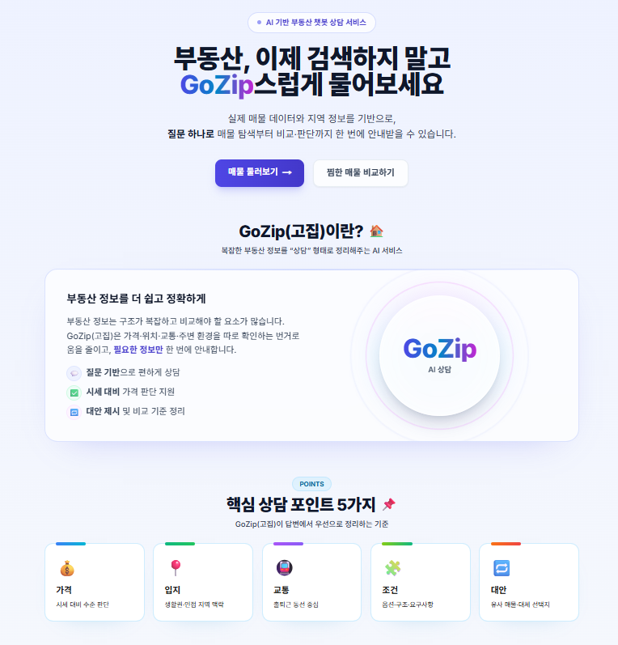
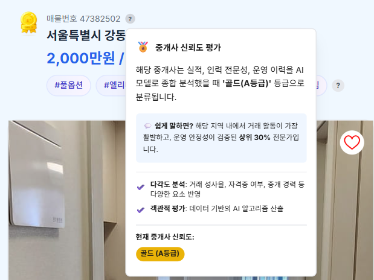
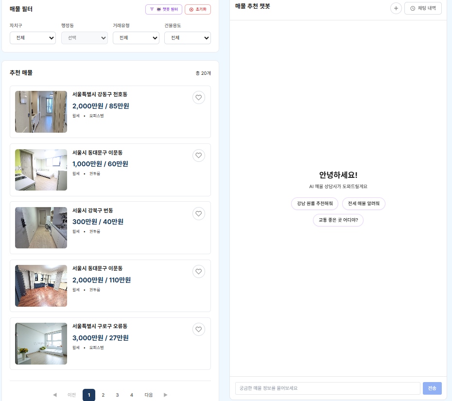
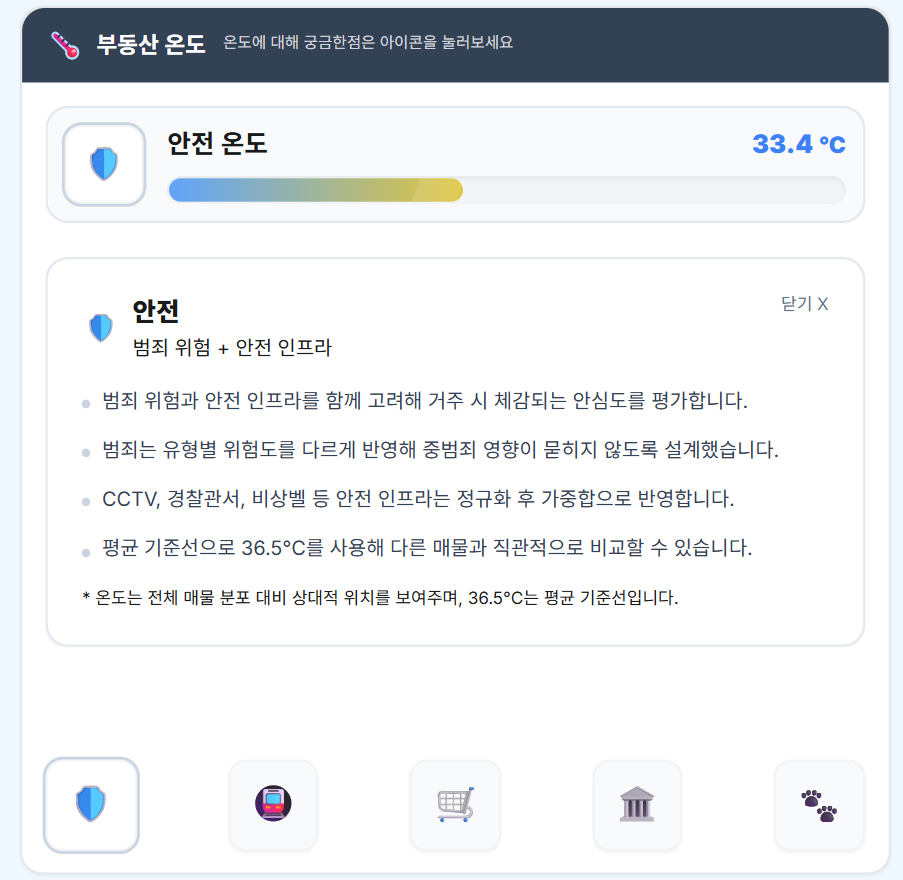

# 🏠 부동산 매물 추천 AI 플랫폼
### 팀원

|이름|역할|메인 업무|깃허브|
|---|---|---|---|
|**이태호**|PM|Elasticsearch, RAG, Frontend, Backend|[william](https://github.com/william7333)|
|**최은정**|APM|중개사 신뢰도 평가 ML, DevOps, Frontend, Backend|[eunjeong0911](https://github.com/eunjeong0911)|
|**임연희**|팀원|실거래가 분류 ML, DevOps, Frontend, Backend|[yheeeon](https://github.com/yheeeon)|
|**김수미**|팀원|중개사 신뢰도 평가 ML, Frontend, Backend|[ghyeju0904](https://github.com/ghyeju0904)|
|**김담하**|팀원|Neo4j, RAG, Frontend, Backend|[DamHA-Kim](https://github.com/DamHA-Kim)|
|**조준호**|팀원|실거래가 분류 ML, Frontend, Backend|[lemondear](https://github.com/lemondear)|


> **AI 기반 부동산 매물 검색 및 추천 서비스**  

[](https://www.python.org/)
[](https://www.djangoproject.com/)
[](https://fastapi.tiangolo.com/)
[](https://www.typescriptlang.org/)
[](https://nextjs.org/)
[](https://reactjs.org/)
[](https://tailwindcss.com/)
[](https://neo4j.com/)
[](https://www.postgresql.org/)
[](https://www.elastic.co/)
[](https://www.langchain.com/)
[](https://www.docker.com/)

웹사이트: [goziphouse](https://goziphouse.com/)

---

## 📋 목차

- [프로젝트 소개](#-프로젝트-소개)
- [주요 기능](#-주요-기능)
- [기술 스택](#-기술-스택)
- [시스템 아키텍처](#-시스템-아키텍처)
- [ML 모델](#-ml-모델)
- [RAG 챗봇](#-rag-챗봇)
- [문서](#-문서)

---

## 🎯 프로젝트 소개

**부동산 매물 추천 AI 플랫폼**은 서울시 부동산 매물 데이터를 기반으로 사용자에게 최적의 매물을 추천하는 지능형 플랫폼입니다.

### 핵심 가치

- **🤖 AI 기반 추천**: 머신러닝 모델을 활용한 중개사 신뢰도 평가 및 가격 적정성 분석
- **💬 RAG 챗봇**: LangGraph 기반 대화형 매물 검색 및 추천 서비스
- **🔍 하이브리드 검색**: Elasticsearch 전문 검색 + Neo4j 그래프 검색의 결합
- **🗺️ 그래프 DB**: Neo4j를 활용한 매물-시설 간 관계 기반 검색
- **📊 실시간 분석**: Elasticsearch를 통한 매물 통계 및 트렌드 분석

### 프로젝트 배경

#### 📊 설문조사 결과

설문조사를 실시한 결과:

**1️⃣ 타 서비스 이용 불편사항**

| 불편사항 | 비율 |
|---------|------|
| **허위매물** | 58.3% |
| **UI/UX** | 16.7% |
| **정보부족** | 12.5% |
| **기타** | 8.3% |
| **매물관리** | 4.2% |

**2️⃣ 신규 서비스 도입 희망 기능**

| 희망 기능 | 비율 |
|----------|------|
| **허위매물 판별** | 25.0% |
| **매물비교/추천** | 21.4% |
| **기타** | 17.9% |
| **검색/필터 개선** | 14.3% |
| **후기/리뷰** | 10.7% |
| **실거래가** | 7.1% |
| **사진/정보** | 3.6% |

---

#### 💡 설문조사 기반 구현 기능

설문조사 결과를 바탕으로 다음 기능을 구현했습니다:

**허위매물 판별**
- 중개사 신뢰도 모델: 거래성사율, 운영기간, 자격구분 등을 활용한 금/은/동 등급 분류
- 매물세부정보에서 중개사 신뢰도 즉시 확인

**매물비교/추천**
- 가격 적정성 모델: 지역별 시세 대비 저렴/적정/비쌈 분류
- 매물세부정보에서 가격 적정성 즉시 확인

**검색/필터 개선**
- AI 챗봇: 자연어 기반 매물 검색
- 하이브리드 검색: Elasticsearch + Neo4j 그래프 DB

**UI/UX 개선**
- 메인 화면에서 채팅으로 바로 원하는 매물 검색 가능
- 여러개 매물 동시에 비교할 수 있는 화면 제공

---

## ✨ 주요 기능

### 1. 🤖 AI 챗봇 (RAG)
- 자연어 기반 매물 검색
- LangGraph 기반 질문 분류 및 응답
- Neo4j + Elasticsearch 하이브리드 검색

### 2.  ML 모델
- 중개사 신뢰도 모델: 금/은/동 등급 분류 (정확도 84.51%)
- 가격 적정성 모델: 저렴/적정/비쌈 분류 (정확도 73.46%)

---

## 🛠️ 기술 스택

### Frontend
- **Framework**: Next.js 14 (App Router)
- **Language**: TypeScript
- **Styling**: Tailwind CSS
- **State Management**: React Context API
- **Map**: Kakao Map API
- **Authentication**: NextAuth.js (Google OAuth)

### Backend
- **Framework**: Django 4.2 + Django REST Framework
- **Language**: Python 3.11
- **API**: FastAPI (RAG 서버, 추천 서버)
- **Authentication**: JWT (djangorestframework-simplejwt)

### Database
- **Relational DB**: PostgreSQL 16 + pgvector (벡터 검색)
- **Graph DB**: Neo4j 5.15 (APOC 플러그인)
- **Cache**: Redis 7

### Search Engine
- **Elasticsearch 8.17**
  - **하이브리드 검색**: 키워드 + k-NN 벡터 검색 결합
  - **텍스트 재정렬**: Neo4j 후보를 텍스트 기반 재정렬
  - **한글 분석**: Nori Analyzer (형태소 분석)
  - **벡터 검색**: text-embedding-3-large (3072차원)
  - **점수 조합**: Neo4j 60% + ES 40%

### AI/ML
- **LLM**: OpenAI GPT-4
- **Framework**: LangChain, LangGraph
- **ML Libraries**: scikit-learn, LightGBM, XGBoost, SHAP
- **Embeddings**: OpenAI text-embedding-ada-002

### Infrastructure
- **Containerization**: Docker, Docker Compose

### Development Tools
- **Package Manager**: uv (Python), npm (Node.js)
- **Version Control**: Git, GitHub
- **Analytics**: Jupyter Notebook

---

## 🏗️ 시스템 아키텍처

### 전체 시스템 구조

```
┌─────────────┐
│   사용자     │
└──────┬──────┘
       │
       ▼
┌─────────────────────────────────────┐
│      Frontend (Next.js 14)          │
│  - 챗봇 인터페이스                    │
│  - 매물 검색 & 필터링                 │
│  - 커뮤니티, 찜 목록                  │
└──────┬──────────────────────────────┘
      │ REST API
       ▼
┌─────────────────────────────────────┐
│    Backend (Django REST API)        │
│  - 사용자 인증/인가 (JWT)             │
│  - 매물 CRUD API                     │
│  - 커뮤니티 API                       │
└──┬────┬─────────┬──────────────┬────┘
   │    │         │              │
   ▼    ▼         ▼              ▼
┌────────────────────────────────────┐
│        Data Layer                  │
│   ┌──────┐ ┌──────┐                │
│   │Neo4j │ │Redis │                │
│   │Graph │ │Cache │                │
│   └──────┘ └──────┘                │
│  ┌──────────────────────┐          │
│  │ Elasticsearch 8.17   │          │
│  │ - 하이브리드 검색    │          │
│  │ - k-NN 벡터 검색     │          │
│  └──────────────────────┘          │
└────────────────────────────────────┘
   ▲              ▲
   │              │
   ▼              ▼
┌────────┐    ┌────────┐
│RAG     │    │Reco    │
│Server  │    │Server  │
│(FastAPI)│    │(FastAPI)│
│- 챗봇   │    │- ML 추천│
│- 검색   │    │- 신뢰도 │
└────┬───┘    │- 가격   │
     │        └────────┘
     ▼
┌─────────────────────┐
│  OpenAI             │
└─────────────────────┘
```

### 주요 컴포넌트


**1. Frontend Layer**
- Next.js 14 (App Router)
- TypeScript + Tailwind CSS
- NextAuth.js (Google OAuth)

**2. Backend Layer**
- Django 4.2 + DRF
- JWT 인증
- RESTful API

**3. Data Layer**
- **PostgreSQL 16**: 매물 데이터, 사용자 정보
- **Neo4j 5.15**: 매물-시설 관계 그래프
- **Elasticsearch 8.17**: 하이브리드 검색 (키워드 + 벡터)
- **Redis 7**: 세션 캐시

**4. AI/ML Services**
- **RAG Server**: LangGraph 기반 챗봇
- **Reco Server**: ML 모델 (신뢰도, 가격)

### 데이터 흐름

**1. 매물 검색 흐름**
```
사용자 → Frontend → Backend → Neo4j/Elasticsearch
→ 하이브리드 검색 (Neo4j 60% + ES 40%)
→ Backend → Frontend → 사용자
```

**2. 챗봇 대화 흐름**
```
사용자 질문 → Frontend → RAG Server
→ LangGraph Pipeline:
   1. apps/rag/nodes/query_analyzer_node.py (질문 분류 / 의도·엔티티 추출)
   2. apps/rag/nodes/neo4j_search_node.py + apps/rag/nodes/vector_search_node.py (병렬 후보 수집)
   3. apps/rag/nodes/soft_filter_rerank_node.py (텍스트 재정렬 및 랭킹 보정)
   4. apps/rag/nodes/sql_search_node.py (상세 정보 조회)
   5. apps/rag/nodes/generate_node.py (LLM 호출 및 응답 생성)
→ Frontend → 사용자
```

**3. ML 모델 추론 흐름**
```
매물 데이터 → Reco Server
→ Trust Model (중개사 신뢰도: 금/은/동)
→ Price Model (가격 적정성: 저렴/적정/비쌈)
→ Backend → Frontend
```
---

## 🤖 ML 모델

### 1. 중개사 신뢰도 모델 (Trust Model)

**목적**: 부동산 중개사의 신뢰도를 금/은/동 등급으로 분류

#### 데이터
- **출처**: 크롤링 데이터 + V-WORLD API (중개업소 정보, 중개업자 정보)
- **규모**: 약 400개 중개사무소
- **매칭**: 3단계 매칭 (중개사무소명+대표자명, 등록번호+중개사무소명, 중개사무소명+대표자명)

#### 타겟 생성
```python
# 1. 거래성사율 계산
거래성사율 = 거래완료 / (거래완료 + 등록매물)

# 2. 지역별 표준화 (Z-score)
Performance_Zscore = (거래성사율 - 지역평균) / 지역표준편차

# 3. 자격점수 표준화
Qual_Zscore = (자격점수 - 평균) / 표준편차

# 4. 복합 Z-score (성사율 70% + 자격 30%)
Zscore = Performance_Zscore * 0.7 + Qual_Zscore * 0.3

# 5. 대표자구분 가중치 적용
대표자구분_가중치 = {
    '공인중개사': 0.0,
    '법인': +0.2,
    '중개보조원': -0.1,
    '중개인': -0.3
}
Zscore_조정 = Zscore + 대표자구분_가중치

# 6. 등급 분류 (Train 기준 분위수)
금등급: 상위 30% (Zscore_조정 > 70th percentile)
은등급: 중위 40% (30th ~ 70th percentile)
동등급: 하위 30% (Zscore_조정 < 30th percentile)
```

#### Feature (총 14개)

**1. 실적 지표 (3개)** - log 변환 적용
- 등록매물_log
- 총거래활동량_log
- 1인당_거래량_log

> **log 변환 이유:**  
> 거래량 데이터는 왜도(Skewness)가 심함 (소수가 매우 많고, 대다수가 적음)  
> → log 변환으로 이상치 영향 감소 및 스케일 정규화

**2. 인력 지표 (3개)**
- 총_직원수
- 중개보조원_비율
- 자격증_보유비율

**3. 경험 지표 (3개)**
- 운영기간_년
- 숙련도_지수
- 운영_안정성

**4. 구조 지표 (1개)**
- 대형사무소

**5. 대표자 자격 (2개)**
- 대표_공인중개사
- 대표_법인

**6. 지역 지표 (2개)**
- 지역_경쟁강도
- 1층_여부

#### 모델 성능

**최종 성능 지표:**
- Test Accuracy: **73.24%**
- Train Accuracy: 80.43%
- 과적합 정도: 7.19%
- CV Mean: 74.76% (±7.60%)

**등급별 성능 (Test 기준):**
- 동등급(0): Precision 0.62, Recall 0.94, F1-Score 0.75
- 은등급(1): Precision 0.75, Recall 0.69, F1-Score 0.72
- 금등급(2): Precision 0.87, Recall 0.65, F1-Score 0.74

**특징:**
- 동등급(신뢰도 낮음) 재현율이 가장 높음 (94%) - 문제 중개사 잘 감지
- 금등급(신뢰도 높음) 정밀도가 가장 높음 (87%) - 우수 중개사 정확히 분류

#### 알고리즘
- **모델**: Logistic Regression
- **최적화**: GridSearchCV (144개 조합 탐색)
- **하이퍼파라미터**: C=1, penalty='l1', solver='saga', class_weight='balanced'



---

### 2. 가격 적정성 모델 (Price Model)

**목적**: 월세 매물의 가격을 저렴/적정/비쌈으로 분류

#### 데이터
- **학습 데이터**: 2024.08~2025.08 서울시 월세 실거래가 (1년치)
- **테스트 데이터**: 2025.09~2025.10 월세 실거래가
- **출처**: 서울시 월세 실거래가 + 한국은행 금리 데이터

#### 타겟 생성
```python
# 1. 환산보증금 계산
적용이자율 = (기준금리 + 2.0%) / 100
환산보증금(만원) = 보증금(만원) + (임대료(만원) × 12) / 적용이자율

# 2. 평당가 계산
환산보증금_평당가 = 환산보증금(만원) / 전용평수

# 3. 행정동×건물용도별 분위수 분류
저렴(0): 33.3% 미만
적정(1): 33.3% ~ 66.7%
비쌈(2): 66.7% 초과
```

#### 피처 (총 19개)
- **지역 정보** (4개): 자치구명_LE, 법정동명_LE, 자치구_건물용도_LE, 구_권역
- **건물 특성** (6개): 건물용도, 임대면적, 면적_qcat, 층, 건축연차, 건축시대
- **지역 집계** (3개): 자치구_월별_임대료수준_구간, 자치구_용도_월별_임대료_평균, 법정동_용도_월별_임대료_평균
- **금리 정보** (2개): KORIBOR, 기업대출
- **가격 구조** (2개): 보증금임대료비율_구간, 보증금_지역대비
- **교호작용** (2개): 면적_x_건축연차, 자치구거래량_x_면적

#### 모델 성능
```
모델별 Test 성능 (F1-Macro):
- LightGBM: 0.7317 (Accuracy: 73.46%) ⭐ 선택
- XGBoost:  0.6854 (Accuracy: 68.80%)
- LSTM:     0.6715 (Accuracy: 67.04%)

LightGBM 등급별 성능:
- 저렴(0): Precision 0.85, Recall 0.85, F1 0.85
- 적정(1): Precision 0.63, Recall 0.63, F1 0.63
- 비쌈(2): Precision 0.74, Recall 0.74, F1 0.74
```

#### 알고리즘
- **모델**: LightGBM
- **최적화**: Early Stopping (50 라운드)
- **이유**: Tree 기반 모델이 Label Encoding과 교호작용 피처에 효율적

#### SHAP 분석 (TOP-3)
1. **보증금_지역대비**: 지역 평균 대비 상대적 가격
2. **임대면적**: 면적 차이로 가격 등급 변화
3. **자치구_월별_임대료수준_구간**: 최근 지역 임대료 수준

상세 내용: [docs/PRICE_ML_MODEL.md](docs/PRICE_ML_MODEL.md)


---

## 💬 RAG 챗봇

### 주요 노드


| 노드 | 파일 (경로) | 역할 |
|------|-------------|------|
| query_analyzer_node | apps/rag/nodes/query_analyzer_node.py | 사용자 질문 분류 및 의도/엔티티 추출 |
| neo4j_search_node | apps/rag/nodes/neo4j_search_node.py | Neo4j 기반 관계·거리 검색 (후보 탐색) |
| sql_search_node | apps/rag/nodes/sql_search_node.py | PostgreSQL에서 매물 상세 조회 |
| es_search_node | apps/rag/nodes/es_search_node.py | Elasticsearch 텍스트/벡터 검색 및 후보 수집 |
| vector_search_node | apps/rag/nodes/vector_search_node.py | 임베딩 기반 유사도 검색 (벡터 검색) |
| soft_filter_rerank_node | apps/rag/nodes/soft_filter_rerank_node.py | 텍스트 재정렬 및 소프트 필터 적용 (랭킹 보정) |
| generate_node | apps/rag/nodes/generate_node.py | LLM 호출 및 응답 생성·포맷팅 (최종 출력) |
| style_mapping | apps/rag/nodes/style_mapping.py | 응답 스타일/포맷 매핑 (선택적 후처리) |

노드 구현은 `apps/rag/nodes/`에 모여 있습니다. 세부 동작이나 파라미터는 각 파일의 주석을 참고하세요.

### 주요 기능

1. **자연어 매물 검색**
   - 예: "강남역 근처 깨끗한 원룸 찾아줘"
   - 하드 필터 (지역, 가격) + 소프트 필터 (깨끗한, 조용한) 동시 처리

2. **허위매물 위험도 분석**
   - 중개사 신뢰도 등급 (A/B/C)

3. **가격 적정성 분석**
   - ML 모델 기반 가격 등급 (저렴/적정/비쌈)
   - 지역 시세 대비 비교

4. **랭킹 시스템**
   - 1순위, 2순위, 3순위 매물 추천
   - 거리, 가격, 온도 지표 종합 고려

5. **상세 정보 제공**
   - 주변 시설까지 거리(m) 및 도보 시간(분)
   - CCTV, 비상벨 개수
   - 온도 지표

상세 가이드: [docs/README_CHATBOT.md](docs/README_CHATBOT.md)

### 🧭 온도 지표(환경 점수) — 항목 설명

온도 지표는 매물의 다양한 생활 요소를 한눈에 보여주기 위한 상대 점수입니다. 각 항목은 해당 범주의 세부 메트릭을 정규화하여 가중합한 후, 전체 매물 분포 대비 상대 위치를 온도(°C)로 표시합니다. 평균 기준선은 약 36.5°C입니다.

- 🛡️ 안전 — 범죄 위험 + 안전 인프라
   - 범죄 유형별 위험도를 구분해 중범죄 영향이 묻히지 않도록 반영합니다.
   - CCTV, 경찰서, 비상벨 등 안전 인프라는 정규화 후 가중합으로 통합합니다.

- 🛒 생활편의 — 일상 편의시설 접근성
   - 편의점, 마트, 세탁소 등 필수 편의시설까지의 거리와 병원·약국 접근성을 평가합니다.
   - 도보 생활권 내 접근성이 가까울수록 높은 점수를 부여합니다.

- 🐾 반려동물 — 반려동물 친화 환경
   - 반려동물 놀이터, 동물병원, 펫샵 등의 접근성을 반영합니다.
   - 산책하기 좋은 공원(1,500㎡ 이상)까지의 거리도 포함합니다.

- 🚇 교통 — 대중교통 접근성 및 출퇴근 편의성
   - 가장 가까운 지하철역의 이용량과 노선 수, 주변 버스정류장 수를 고려합니다.
   - 주요 업무지구(예: 강남, 여의도)까지의 거리로 출퇴근 편의성을 보정합니다.

- 🎨 문화 — 문화·여가 시설 접근성
   - 영화관, 미술관, 공연장, 도서관 등 문화 시설까지의 거리를 평가합니다.
   - 공원·녹지 접근성도 여가 환경의 일부로 반영합니다.

이 기준을 바탕으로 알고리즘을 설계하면(정규화·가중합·퍼센타일 스케일링 등), API 응답으로 사용자에게 각 항목의 온도와 구성 요소를 전달할 수 있습니다.



---
## 🚀 배포 가이드

### AWS 배포 아키텍처

```
GitHub
  ↓ (Push)
AWS CodePipeline
  ↓
AWS CodeBuild (Docker 이미지 빌드)
  ↓
Amazon ECR (이미지 저장)
  ↓
AWS CodeDeploy
  ↓
Amazon ECS (Fargate)
  ├── Frontend (Next.js)
  ├── Backend (Django)
  ├── RAG Server (FastAPI)
  └── Reco Server (FastAPI)
  
데이터베이스:
  ├── Amazon RDS (PostgreSQL)
  ├── Neo4j AuraDB
  ├── Amazon ElastiCache (Redis)
  └── Amazon OpenSearch Service
```

### 배포 단계

1. **인프라 설정**
   - RDS PostgreSQL 인스턴스 생성
   - Neo4j AuraDB 인스턴스 생성
   - ElastiCache Redis 클러스터 생성
   - OpenSearch Service 도메인 생성
   - ECR 리포지토리 생성

2. **CI/CD 파이프라인**
   - CodePipeline 생성 (Source: GitHub)
   - CodeBuild 프로젝트 생성 (buildspec.yml)
   - CodeDeploy 애플리케이션 생성

3. **ECS 배포**
   - ECS 클러스터 생성 (Fargate)
   - Task Definition 작성
   - Service 생성 (로드 밸런서 연결)

4. **환경 변수 설정**
   - AWS Secrets Manager에 시크릿 저장
   - SSM Parameter Store에 설정 저장
   - ECS Task Definition에서 참조

5. **데이터 마이그레이션**
   - 로컬 PostgreSQL 덤프
   - RDS로 복원
   - Neo4j 데이터 Import

상세 가이드: [docs/DOCKER_DEPLOYMENT_GUIDE.md](docs/DOCKER_DEPLOYMENT_GUIDE.md)

---

## 📚 문서

### 아키텍처 및 설계
- [Architecture_Diagrams.md](docs/Architecture_Diagrams.md) - 전체 시스템 아키텍처 및 시퀀스 다이어그램
- [erd.md](docs/erd.md) - 데이터베이스 ERD
- [graph_schema.md](docs/graph_schema.md) - Neo4j 그래프 스키마
- [폴더구조.md](docs/폴더구조.md) - 프로젝트 폴더 구조

### API 및 백엔드
- [api_spec.md](docs/api_spec.md) - API 명세서
- [API_TEST_RESULTS.md](docs/API_TEST_RESULTS.md) - API 테스트 결과
- [backend_readme.md](docs/backend_readme.md) - 백엔드 개발 가이드

### 기능 구현
- [FILTER_FEATURE.md](docs/FILTER_FEATURE.md) - 매물 필터링 기능
- [MAP_FEATURE.md](docs/MAP_FEATURE.md) - 지도 기능
- [MAP_DETAIL_FEATURE.md](docs/MAP_DETAIL_FEATURE.md) - 지도 상세 기능
- [MAP_OVERLAY_FEATURE.md](docs/MAP_OVERLAY_FEATURE.md) - 지도 오버레이 기능
- [DATA_STATISTICS.md](docs/DATA_STATISTICS.md) - 매물 데이터 통계
- [README_CHATBOT.md](docs/README_CHATBOT.md) - 챗봇 기능 가이드

### ML 모델
- [PRICE_ML_MODEL.md](docs/PRICE_ML_MODEL.md) - 가격 적정성 모델
- [trust_model/README.md](apps/reco/trust_model/README.md) - 중개사 신뢰도 모델
- [MODEL_APPLICATION_README.md](docs/MODEL_APPLICATION_README.md) - 모델 적용 가이드

### 개발 환경
- [START.md](START.md) - 빠른 시작 가이드
- [START_FOR_DEVELOPER.md](START.md) - 개발자 가이드
- [가상환경.md](docs/가상환경.md) - Python 가상환경 설정

---

## 👥 팀

**SKN18-FINAL-1TEAM** - SK Networks Family AI Camp 18기 최종 프로젝트

---
**Made with ❤️ by SKN18-FINAL-1TEAM**
