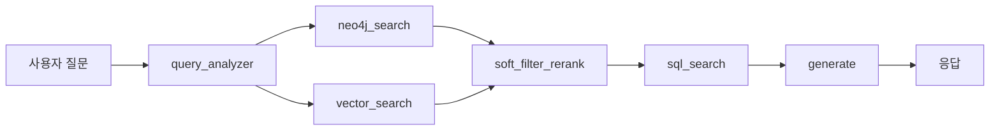

<p align="center">
  
</p>

<h1 align="center">🏠 GoZip - 부동산 매물 추천 AI 플랫폼</h1>

<p align="center">
  <strong>AI 기반 부동산 매물 검색 및 추천 서비스</strong><br/>
  서울특별시 부동산 매물 데이터를 기반으로 최적의 매물을 추천하는 지능형 플랫폼
</p>

<p align="center">
  <a href="https://goziphouse.com/">🌐 웹사이트 바로가기</a>
</p>

<p align="center">
  
  
  
  
  
</p>

<p align="center">
  
  
  
  
  
</p>

---

## 👥 팀 소개

<table align="center">
  <tr>
    <td align="center"><b>이름</b></td>
    <td align="center"><b>역할</b></td>
    <td align="center"><b>주요 업무</b></td>
    <td align="center"><b>GitHub</b></td>
  </tr>
  <tr>
    <td align="center"><b>이태호</b></td>
    <td align="center">👑 PM</td>
    <td>Elasticsearch, RAG, Frontend, Backend</td>
    <td align="center"><a href="https://github.com/william7333">@william7333</a></td>
  </tr>
  <tr>
    <td align="center"><b>최은정</b></td>
    <td align="center">⭐ APM</td>
    <td>중개사 신뢰도 ML, DevOps, Frontend, Backend</td>
    <td align="center"><a href="https://github.com/eunjeong0911">@eunjeong0911</a></td>
  </tr>
  <tr>
    <td align="center"><b>임연희</b></td>
    <td align="center">🔧 팀원</td>
    <td>실거래가 분류 ML, DevOps, Frontend, Backend</td>
    <td align="center"><a href="https://github.com/yheeeon">@yheeeon</a></td>
  </tr>
  <tr>
    <td align="center"><b>김수미</b></td>
    <td align="center">🔧 팀원</td>
    <td>중개사 신뢰도 ML, Frontend, Backend</td>
    <td align="center"><a href="https://github.com/ghyeju0904">@ghyeju0904</a></td>
  </tr>
  <tr>
    <td align="center"><b>김담하</b></td>
    <td align="center">🔧 팀원</td>
    <td>Neo4j, RAG, Frontend, Backend</td>
    <td align="center"><a href="https://github.com/DamHA-Kim">@DamHA-Kim</a></td>
  </tr>
  <tr>
    <td align="center"><b>조준호</b></td>
    <td align="center">🔧 팀원</td>
    <td>실거래가 분류 ML, Frontend, Backend</td>
    <td align="center"><a href="https://github.com/lemondear">@lemondear</a></td>
  </tr>
</table>

---

## 📋 목차

<details>
<summary><b>펼쳐서 보기</b></summary>

- [프로젝트 소개](#-프로젝트-소개)
- [핵심 기능](#-핵심-기능)
- [데이터 규모](#-데이터-규모)
- [기술 스택](#️-기술-스택)
- [시스템 아키텍처](#️-시스템-아키텍처)
- [ML 모델](#-ml-모델)
- [RAG 챗봇](#-rag-챗봇)
- [온도 지표](#-온도-지표환경-점수)
- [배포 아키텍처](#-배포-아키텍처)
- [문서](#-문서)

</details>

---

## 🎯 프로젝트 소개

### 💡 프로젝트 배경

<table>
<tr>
<td width="50%">

#### 📊 설문조사 결과 (125명 대상)

**1️⃣ 타 서비스 이용 불편사항**

| 불편사항 | 비율 |
|:--------:|:----:|
| 🚨 **허위매물** | **58.3%** |
| 🎨 UI/UX | 16.7% |
| 📄 정보부족 | 12.5% |
| 📦 매물관리 | 4.2% |

</td>
<td width="50%">

**2️⃣ 신규 서비스 희망 기능**

| 희망 기능 | 비율 |
|:---------:|:----:|
| 🔍 **허위매물 판별** | **25.0%** |
| 📊 **매물비교/추천** | **21.4%** |
| 🔎 검색/필터 개선 | 14.3% |
| ⭐ 후기/리뷰 | 10.7% |

</td>
</tr>
</table>

### ✅ 설문조사 기반 구현 기능

| 문제점 | 해결책 | 구현 |
|:------:|:------:|:-----|
| 🚨 허위매물 | 중개사 신뢰도 모델 | 거래성사율, 운영기간, 자격구분 → 골드/실버/브론즈 등급 분류 |
| 💰 가격 불투명 | 가격 적정성 모델 | 지역별 시세 대비 → 저렴/적정/비쌈 자동 분류 |
| 🔍 복잡한 검색 | AI 챗봇 | 자연어 기반 매물 검색 + 하이브리드 검색 |
| 🎨 불편한 UI | 직관적 UX | 채팅으로 바로 검색 + 매물 동시 비교 화면 |

---

## ⭐ 핵심 기능

<table>
<tr>
<td width="50%">

### 🤖 AI 챗봇 (RAG)
- 자연어 기반 매물 검색
- LangGraph 기반 질문 분류 및 응답
- Neo4j + Elasticsearch 하이브리드 검색

### 📊 중개사 신뢰도 분석
- **골드/실버/브론즈** 등급 자동 분류
- 정확도 **73.24%**
- 브론즈등급 재현율 94% (문제 중개사 감지)

</td>
<td width="50%">

### 💰 가격 적정성 분석
- **저렴/적정/비쌈** 자동 분류
- 정확도 **73.46%**, F1-macro 0.7317
- 지역×건물용도별 상대 시세 비교

### 🌡️ 온도 지표
- 안전 / 생활편의 / 교통 / 문화 / 반려동물
- 각 항목 점수화 후 온도(°C)로 표시
- 평균 기준선: 36.5°C

</td>
</tr>
</table>

---

## 📈 데이터 규모

<table align="center">
<tr>
<td align="center"><b>📦 총 매물</b><br/><h2>30,000+</h2></td>
<td align="center"><b>🏢 중개사무소</b><br/><h2>400+</h2></td>
<td align="center"><b>🗺️ 커버리지</b><br/><h2>서울 25개구</h2></td>
<td align="center"><b>📅 데이터 기간</b><br/><h2>14개월</h2></td>
</tr>
</table>

### 📊 데이터 소스

| 데이터 출처 | 설명 | 용도 |
|:-----------:|:-----|:-----|
| 🏠 **직방 API** | 서울시 월세/전세 원룸 매물 | 실시간 매물 정보 |
| 🏡 **피터팬** | 서울시 부동산 매물 크롤링 | 매물 상세 정보 |
| 🗂️ **V-WORLD API** | 중개업소/중개업자 정보 | 중개사 신뢰도 모델 학습 |
| 📊 **서울시 열린 데이터** | 월세 실거래가 + 한국은행 금리 | 가격 적정성 모델 학습 |
| 🏛️ **공공 데이터** | CCTV, 범죄 통계, 시설, 교통 | 온도 지표 산출 |

### 📈 거래유형별 분포

```
월세     ████████████████████████████████████████ 64.1%
전세     ████████████ 19.8%
단기임대  ██████ 10.2%
매매     ███ 5.9%
```

---

## 🛠️ 기술 스택

<table>
<tr>
<td width="50%">

### 🎨 Frontend
| 기술 | 버전 | 용도 |
|:----:|:----:|:-----|
| Next.js | 14 | App Router |
| TypeScript | 5.3 | 타입 안정성 |
| Tailwind CSS | 3.4 | 스타일링 |
| NextAuth.js | - | Google OAuth |
| Kakao Map API | - | 지도 표시 |

### ⚙️ Backend
| 기술 | 버전 | 용도 |
|:----:|:----:|:-----|
| Django | 4.2 | REST API |
| FastAPI | 0.109 | RAG/추천 서버 |
| Python | 3.11 | 언어 |
| JWT | - | 인증 |

</td>
<td width="50%">

### 🗄️ Database
| 기술 | 버전 | 용도 |
|:----:|:----:|:-----|
| PostgreSQL | 16 | 매물/사용자 데이터 |
| Neo4j | 5.15 | 그래프 DB |
| Elasticsearch | 8.17 | 하이브리드 검색 |
| Redis | 7 | 세션 캐시 |

### 🤖 AI/ML
| 기술 | 용도 |
|:----:|:-----|
| OpenAI GPT-4o-mini | LLM |
| LangChain + LangGraph | RAG 파이프라인 |
| LightGBM | 가격 적정성 모델 |
| Logistic Regression | 중개사 신뢰도 모델 |
| text-embedding-3-large | 벡터 임베딩 (3072차원) |

</td>
</tr>
</table>

---

## 🏗️ 시스템 아키텍처

```
                              ┌─────────────────┐
                              │     사용자       │
                              └────────┬────────┘
                                       │
                                       ▼
┌──────────────────────────────────────────────────────────────────┐
│                     Frontend (Next.js 14)                        │
│  🎨 챗봇 UI  │  🗺️ 지도 검색  │  📋 매물 비교  │  ❤️ 찜 목록    │
└───────────────────────────────┬──────────────────────────────────┘
                                │ REST API
                                ▼
┌──────────────────────────────────────────────────────────────────┐
│                    Backend (Django REST API)                     │
│         🔐 JWT 인증  │  📦 매물 CRUD  │  👥 커뮤니티 API          │
└────────┬────────────────────┬─────────────────────┬──────────────┘
         │                    │                     │
         ▼                    ▼                     ▼
┌────────────────┐   ┌────────────────┐   ┌────────────────────────┐
│  RAG Server    │   │  Reco Server   │   │      Data Layer        │
│  (FastAPI)     │   │  (FastAPI)     │   │ ┌──────┐ ┌──────────┐  │
│                │   │                │   │ │Neo4j │ │PostgreSQL│  │
│ 🤖 LangGraph   │   │ 🎯 신뢰도 ML   │   │ └──────┘ └──────────┘  │
│ 💬 챗봇 응답   │   │ 💰 가격 ML     │   │ ┌──────────────┐ ┌───┐ │
│                │   │                │   │ │Elasticsearch │ │Red│ │
└───────┬────────┘   └────────────────┘   │ └──────────────┘ └───┘ │
        │                                 └────────────────────────┘
        ▼
┌────────────────┐
│   OpenAI API   │
│ GPT-4o-mini    │
└────────────────┘
```

### 🔄 데이터 흐름

<details>
<summary><b>1️⃣ 매물 검색 흐름</b></summary>

```
사용자 → Frontend → Backend → Neo4j/Elasticsearch
                              ↓
              하이브리드 검색 (Neo4j 60% + ES 40%)
                              ↓
              Backend → Frontend → 사용자
```
</details>

<details>
<summary><b>2️⃣ 챗봇 대화 흐름</b></summary>

```
사용자 질문 → Frontend → RAG Server → LangGraph Pipeline:
   ├── 1. query_analyzer_node (질문 분류/의도 추출)
   ├── 2. neo4j_search_node + vector_search_node (병렬 검색)
   ├── 3. soft_filter_rerank_node (재정렬 및 랭킹)
   ├── 4. sql_search_node (상세 정보 조회)
   └── 5. generate_node (LLM 응답 생성)
→ Frontend → 사용자
```
</details>

<details>
<summary><b>3️⃣ ML 모델 추론 흐름</b></summary>

```
매물 데이터 → Reco Server
   ├── Trust Model (중개사 신뢰도: 골드/실버/브론즈)
   └── Price Model (가격 적정성: 저렴/적정/비쌈)
→ Backend → Frontend
```
</details>

---

## 🤖 ML 모델

### 1️⃣ 중개사 신뢰도 모델 (Trust Model)

> **목적**: 부동산 중개사의 신뢰도를 골드/실버/브론즈 등급으로 분류

<table>
<tr>
<td width="60%">

#### 📊 모델 성능

| 지표 | 수치 |
|:----:|:----:|
| **Test Accuracy** | **73.24%** |
| Train Accuracy | 80.43% |
| 과적합 정도 | 7.19% |
| CV Mean | 74.76% (±7.60%) |

#### 🎯 등급별 성능

| 등급 | Precision | Recall | F1 |
|:----:|:---------:|:------:|:--:|
| 🥉 브론즈 | 0.62 | **0.94** | 0.75 |
| 🥈 실버 | 0.75 | 0.69 | 0.72 |
| 🥇 골드 | **0.87** | 0.65 | 0.74 |

</td>
<td width="40%">

#### 🔧 알고리즘
- **모델**: Logistic Regression
- **최적화**: GridSearchCV (144개 조합)
- **하이퍼파라미터**: 
  - C=1, penalty='l1'
  - solver='saga'
  - class_weight='balanced'

#### 💡 특징
- 🥉 브론즈 **재현율 94%** → 문제 중개사 효과적 감지
- 🥇 골드 **정밀도 87%** → 우수 중개사 정확 분류

</td>
</tr>
</table>


---

### 2️⃣ 가격 적정성 모델 (Price Model)

> **목적**: 월세 매물의 가격을 저렴/적정/비쌈으로 분류

<table>
<tr>
<td width="50%">

#### 📊 모델 비교 (Test F1-Macro)

| 모델 | F1-Macro | Accuracy |
|:----:|:--------:|:--------:|
| ⭐ **LightGBM** | **0.7317** | **73.46%** |
| XGBoost | 0.6854 | 68.80% |
| LSTM | 0.6715 | 67.04% |

</td>
<td width="50%">

#### 🎯 등급별 성능 (LightGBM)

| 등급 | Precision | Recall | F1 |
|:----:|:---------:|:------:|:--:|
| 💚 저렴 | 0.85 | 0.85 | 0.85 |
| 💛 적정 | 0.63 | 0.63 | 0.63 |
| ❤️ 비쌈 | 0.74 | 0.74 | 0.74 |

</td>
</tr>
</table>

#### 📈 SHAP 분석 TOP-3

1. **보증금_지역대비** - 지역 평균 대비 상대적 가격
2. **임대면적** - 면적 차이로 가격 등급 변화
3. **자치구_월별_임대료수준_구간** - 최근 지역 임대료 수준


---

## 💬 RAG 챗봇

### 🔧 LangGraph 파이프라인



### 🎯 주요 기능

| 기능 | 설명 | 예시 |
|:----:|:-----|:-----|
| 🗣️ **자연어 검색** | 하드필터 + 소프트필터 동시 처리 | "홍대역 근처 깨끗한 원룸" |
| 🔍 **허위매물 분석** | 중개사 신뢰도 등급 제공 | 골드/실버/브론즈 |
| 💰 **가격 분석** | 지역×용도별 시세 비교 | 저렴/적정/비쌈 |
| 🏆 **랭킹 시스템** | 1순위~3순위 매물 추천 | 거리+가격+온도 종합 |

### 🧪 RAG 챗봇 검증

벤치마크 테스트를 통해 응답 품질 검증:

- ✅ 복합 쿼리 성능 (위치 + 가격 + 편의시설)
- ✅ Neo4j 그래프 검색 정확도
- ✅ LLM 응답 생성 품질
- ✅ 검색 결과와 응답 일관성

📊 벤치마크 결과: [docs/benchmark/](docs/benchmark/)

---

## 🌡️ 온도 지표(환경 점수)

> 매물의 다양한 생활 요소를 한눈에 보여주는 상대 점수 (평균 기준선: 36.5°C)

<table>
<tr>
<td width="20%" align="center">🛡️<br/><b>안전</b></td>
<td>범죄 위험도 + 안전 인프라 (CCTV, 경찰서, 비상벨)</td>
</tr>
<tr>
<td align="center">🛒<br/><b>생활편의</b></td>
<td>편의점, 마트, 세탁소 등 필수 편의시설 접근성</td>
</tr>
<tr>
<td align="center">🚇<br/><b>교통</b></td>
<td>지하철역 이용량, 노선 수, 버스정류장 수, 업무지구 거리</td>
</tr>
<tr>
<td align="center">🎨<br/><b>문화</b></td>
<td>영화관, 미술관, 공연장, 도서관, 공원 접근성</td>
</tr>
<tr>
<td align="center">🐾<br/><b>반려동물</b></td>
<td>동물병원, 펫샵, 반려동물 놀이터, 산책로 접근성</td>
</tr>
</table>

<p align="center">
  
</p>

---

## 🚀 배포 아키텍처

```
GitHub → AWS CodePipeline → CodeBuild → ECR → CodeDeploy → ECS (Fargate)
                                                              │
                    ┌─────────────────────────────────────────┼─────────────────┐
                    │                                         │                 │
              ┌─────┴─────┐   ┌─────────────┐   ┌─────────────┴───┐   ┌────────┴────────┐
              │ Frontend  │   │   Backend   │   │   RAG Server    │   │   Reco Server   │
              │ (Next.js) │   │  (Django)   │   │   (FastAPI)     │   │   (FastAPI)     │
              └───────────┘   └─────────────┘   └─────────────────┘   └─────────────────┘
                    │                 │                   │                     │
                    └─────────────────┼───────────────────┼─────────────────────┘
                                      ▼                   ▼
              ┌───────────────────────────────────────────────────────────────────┐
              │                         Data Layer                                 │
              │  RDS (PostgreSQL)  │  Neo4j AuraDB  │  ElastiCache  │  OpenSearch  │
              └───────────────────────────────────────────────────────────────────┘
```

---

## 📚 문서

<details>
<summary><b>🏗️ 아키텍처 및 설계</b></summary>

- [Architecture_Diagrams.md](docs/Architecture_Diagrams.md) - 전체 시스템 아키텍처
- [erd.md](docs/erd.md) - 데이터베이스 ERD
- [graph_schema.md](docs/graph_schema.md) - Neo4j 그래프 스키마
- [폴더구조.md](docs/폴더구조.md) - 프로젝트 폴더 구조

</details>

<details>
<summary><b>🔌 API 및 백엔드</b></summary>

- [api_spec.md](docs/api_spec.md) - API 명세서
- [API_TEST_RESULTS.md](docs/API_TEST_RESULTS.md) - API 테스트 결과
- [backend_readme.md](docs/backend_readme.md) - 백엔드 개발 가이드

</details>

<details>
<summary><b>🎯 기능 구현</b></summary>

- [FILTER_FEATURE.md](docs/FILTER_FEATURE.md) - 매물 필터링 기능
- [MAP_FEATURE.md](docs/MAP_FEATURE.md) - 지도 기능
- [README_CHATBOT.md](docs/README_CHATBOT.md) - 챗봇 기능 가이드

</details>

<details>
<summary><b>🤖 ML 모델</b></summary>

- [PRICE_ML_MODEL.md](docs/PRICE_ML_MODEL.md) - 가격 적정성 모델
- [trust_model/README.md](apps/reco/trust_model/README.md) - 중개사 신뢰도 모델
- [MODEL_APPLICATION_README.md](docs/MODEL_APPLICATION_README.md) - 모델 적용 가이드

</details>

<details>
<summary><b>🚀 개발 환경</b></summary>

- [START.md](START.md) - 빠른 시작 가이드
- [DOCKER_DEPLOYMENT_GUIDE.md](docs/DOCKER_DEPLOYMENT_GUIDE.md) - Docker 배포 가이드

</details>

---

<p align="center">
  <b>SKN18-FINAL-1TEAM</b> - SK Networks Family AI Camp 18기 최종 프로젝트
</p>

<p align="center">
  Made with ❤️ by GoZip Team
</p>
