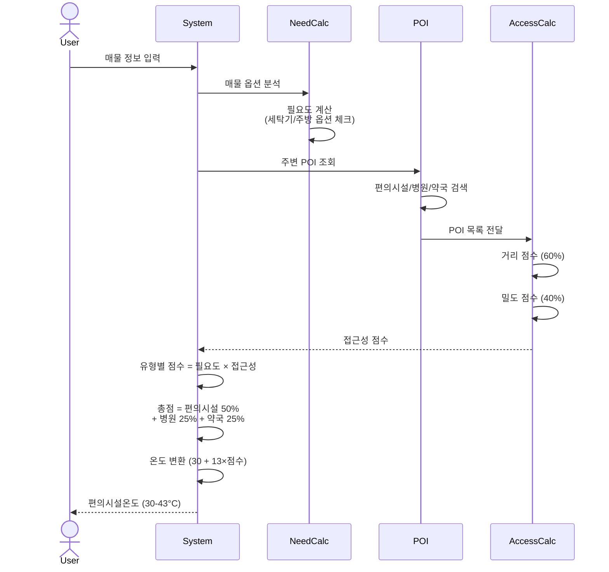
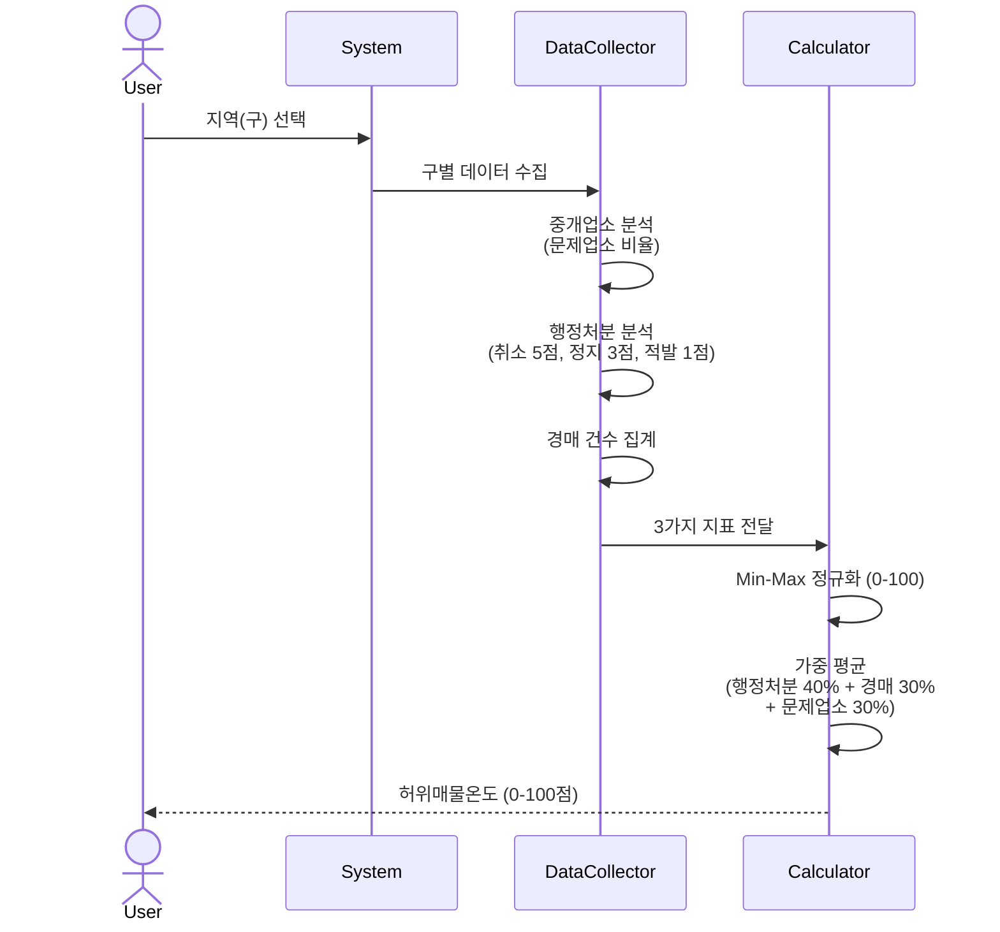
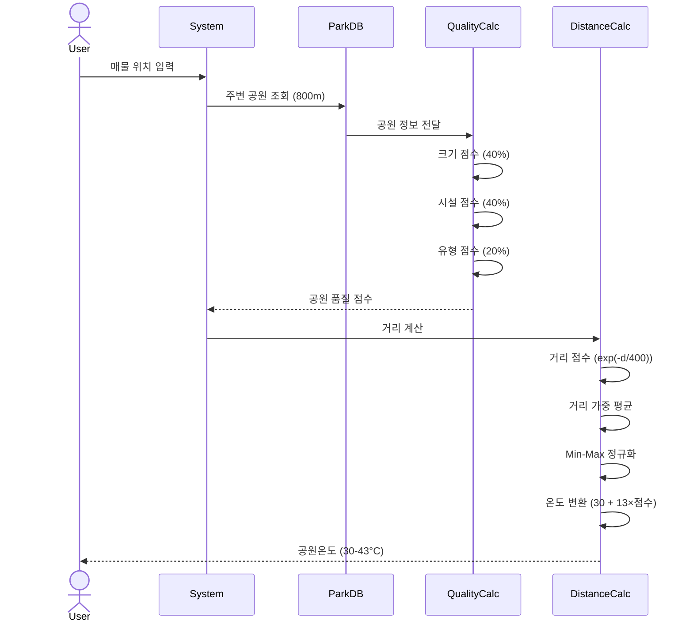
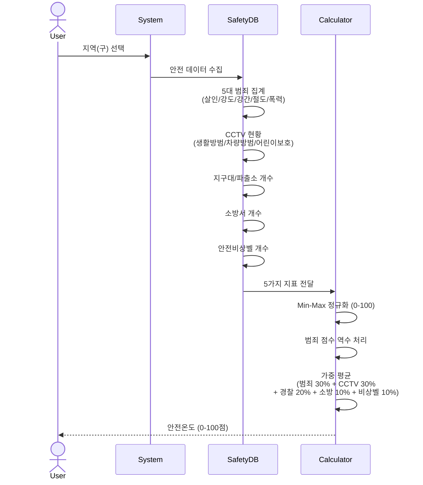
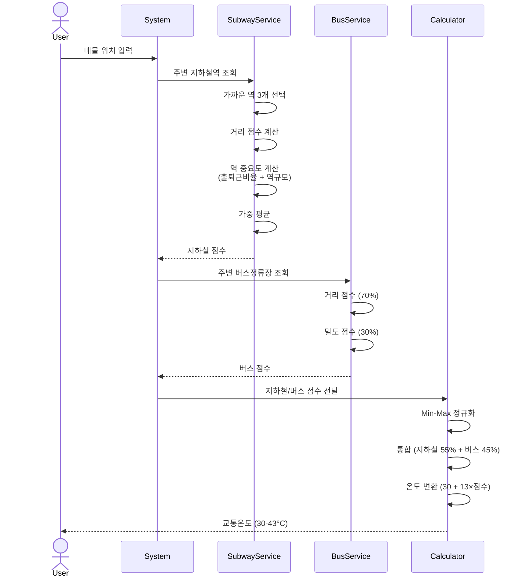

# 온도 계산 시퀀스 다이어그램

## 1. 편의시설온도 🏪

## 2. 허위매물온도 ⚠️

## 3. 공원온도 🌳

## 4. 안전온도 🛡️

## 5. 교통온도 🚇

## 📊 요약 비교표

| 온도 | 입력 | 주요 계산 | 출력 |
|------|------|----------|------|
| **편의시설** | 매물 정보 | 필요도 × 접근성 | 30-43°C |
| **허위매물** | 지역 | 중개업소 + 행정처분 + 경매 | 30-43°C |
| **공원** | 매물 위치 | 공원 품질 × 거리 | 30-43°C |
| **안전** | 지역 | 범죄 + 인프라 | 30-43°C |
| **교통** | 매물 위치 | 지하철 + 버스 | 30-43°C |
