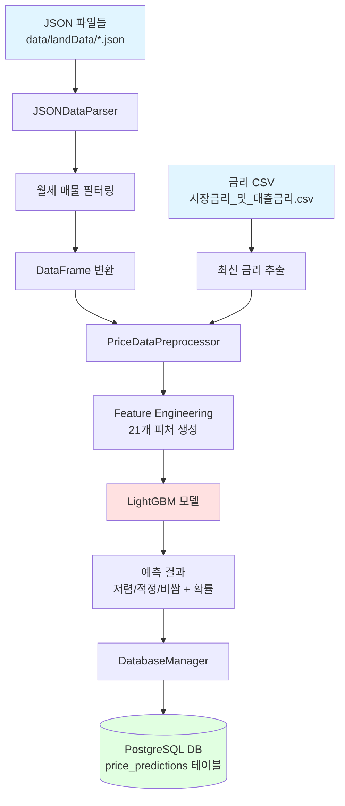

# 월세 가격 분류 모델 적용 가이드

> 학습된 LightGBM 모델을 실제 피터팬 매물 데이터에 적용하여 가격 분류 결과를 DB에 저장하는 전체 프로세스 설명서

---

## 📋 목차

1. [개요](#1-개요)
2. [실행 방법](#2-실행-방법)
3. [데이터 흐름도](#3-데이터-흐름도)
4. [핵심 파일 설명](#4-핵심-파일-설명)
5. [출력 결과](#6-출력-결과)

---

## 1. 개요

### 1.1 목적
- 피터팬 크롤링 데이터(JSON)를 학습된 ML 모델에 입력하여 **저렴/적정/비쌈** 분류
- 분류 결과를 PostgreSQL DB에 저장하여 프론트엔드에서 활용

### 1.2 전체 프로세스
```
JSON 파일 → 파싱 → 전처리 → 모델 예측 → DB 저장
```

---

## 2. 실행 방법

```bash
python apply_model_to_json.py
```
---

## 3. 데이터 흐름도



---

## 4. 핵심 파일 설명

### 4.1 `apply_model_to_json.py` (메인 실행 파일)

**역할**: 전체 파이프라인 오케스트레이션

**실행 흐름**:
1. 모델 로드 (`.pkl` 파일)
2. JSON 데이터 파싱
3. 금리 데이터 병합
4. Feature Engineering
5. 모델 예측
6. DB 저장

---

### 4.2 `json_data_parser.py` (JSON 파싱)

**역할**: 피터팬 크롤링 JSON을 모델 입력 형식으로 변환

#### 4.2.1 파싱 로직

| 필드 | 파싱 방법 | 예시 |
|------|-----------|------|
| **주소** | 정규식으로 자치구/법정동 추출 | "강남구 역삼동" → 자치구명: "강남구", 법정동명: "역삼동" |
| **가격** | 억/만원 단위 파싱 | "1억 2,000만원" → 12000.0 (만원) |
| **면적** | 전용면적 추출 | "21.95m²(공급 31.95m²)" → 21.95 |
| **층수** | 숫자 추출 또는 매핑 | "중층(총 9층)" → 5 (중층=5층, 지하는 -1로 매핑) |
| **건축년도** | 사용승인일에서 4자리 숫자 추출 | "2013" → 2013 |
| **건물용도** | 파일명 기반 매핑(우선) | "00_통합_아파트.json" → "아파트" / "00_통합_오피스텔.json" → "오피스텔" / "그 외.json" → "연립다세대"|

---

### 4.3 `preprocessor.py` (데이터 전처리)

**역할**: 모델 학습 시와 동일한 Feature Engineering 수행

**핵심 기능**:

#### 4.3.1 타깃 변수 생성
```python
# 환산보증금 계산
적용이자율 = (기준금리 + 2.0) / 100
환산보증금 = 보증금 + (임대료 × 12) / 적용이자율
환산보증금_평당가 = 환산보증금 / 전용평수
```

#### 4.3.2 Feature Engineering (21개 피처)

**1) 지역 정보 (4개)**
- `자치구명_LE`: Label Encoding
- `법정동명_LE`: Label Encoding
- `자치구_건물용도_LE`: 복합 카테고리
- `구_권역`: 동/서/남/북 권역

**2) 건물 특성 (6개)**
- `건물용도`: 아파트/빌라/오피스텔 등
- `임대면적`: 전용면적 (㎡)
- `면적_qcat`: 면적 5분위수
- `층`: 실제 층수
- `건축연차`: 계약연도 - 건축년도
- `건축시대`: 건축년도 구간

**3) 지역 집계 (4개)**
- `자치구_월별_임대료수준_구간`: 지역 평균 대비 수준
- `자치구_용도_월별_임대료_평균`: 지역×용도×월 평균
- `법정동_용도_월별_임대료_평균`: 법정동 수준 평균
- `동용도_희소도_구간`: 희소성 지표

**4) 금리 정보 (2개)**
- `KORIBOR`: 코리보 금리
- `기업대출`: 기업대출금리

**5) 가격 구조 (2개)**
- `보증금임대료비율_구간`: 보증금/월세 비율
- `보증금_지역대비`: 지역 평균 대비 보증금

**6) 교호작용 (3개)**
- `면적_x_건축연차`: 면적 × 건축연차
- `자치구거래량_x_면적`: 거래량 × 면적
- `자치구_x_금리평균`: 지역 × 금리

---

### 4.4 `db_manager.py` (DB 저장)

**역할**: PostgreSQL DB에 예측 결과 저장

**주요 클래스**: `DatabaseManager`

**핵심 기능**:

#### 4.4.1 테이블 구조
```sql
CREATE TABLE IF NOT EXISTS price_predictions (
    id SERIAL PRIMARY KEY,
    매물번호 VARCHAR(50) UNIQUE,
    매물_URL TEXT,
    전체주소 TEXT,
    자치구명 VARCHAR(50),
    법정동명 VARCHAR(100),
    건물용도 VARCHAR(50),
    보증금_만원 DECIMAL(12, 2),
    월세_만원 DECIMAL(12, 2),
    임대면적 DECIMAL(10, 2),
    층 INTEGER,
    건축년도 INTEGER,
    예측_클래스 INTEGER,           -- 0: 저렴, 1: 적정, 2: 비쌈
    예측_레이블 VARCHAR(20),        -- UNDERPRICED, FAIR, OVERPRICED
    예측_레이블_한글 VARCHAR(20),   -- 저렴, 적정, 비쌈
    저렴_확률 DECIMAL(5, 4),
    적정_확률 DECIMAL(5, 4),
    비쌈_확률 DECIMAL(5, 4),
    예측_일시 TIMESTAMP DEFAULT CURRENT_TIMESTAMP
);
```

---
