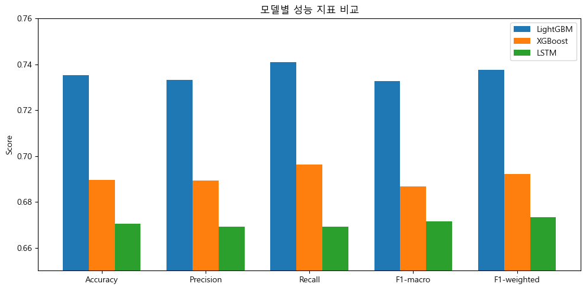
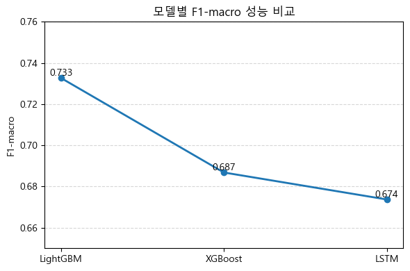
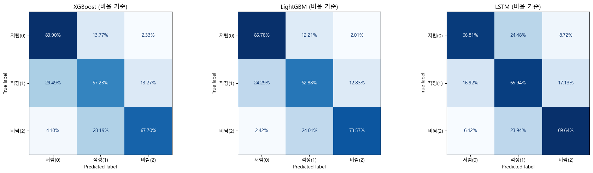

# 월세 가격 분류 모델
- 1, 2, 3, 6번 -> ML & DL
- 4, 5, 7번 -> ML


## 0. 실행방법
```
prepare_wolse_dataset.py # 전처리 파일 생성
main.py                  # 모델(.pkl) 생성
example_shap.py          # shap 그래프 생성 
apply_model_to_json.py   # 피터팬 매물에 모델 적용
```

## 1. 문제 정의

### 1.1 목표
서울시 월세 실거래가 데이터를 활용하여, 특정 매물이 **저렴(UNDERPRICED)**, **적정(FAIR)**, **비쌈(OVERPRICED)** 중 어느 범주에 속하는지 분류하는 3중 분류 모델 개발

### 1.2 데이터
- **학습 데이터**: 2024년 8월 ~ 2025년 8월 월세 실거래가 (1년치)
   - 이유: 1년의 기간으로 계절성 반영 + 최근 1년 데이터를 활용하여 정확성 및 일관성 있음
- **테스트 데이터**: 2025년 9월 ~ 2025년 10월 월세 실거래가
- **데이터 출처**: 서울시 월세 실거래가 + 한국은행 금리 데이터

---

## 2. 타깃 변수 설계

### 2.1 가격 지표: 환산보증금 평당가

```
환산보증금(만원) = 보증금(만원) + (임대료(만원) × 12) / 적용이자율
적용이자율 = (기준금리 + 2.0%) / 100
환산보증금_평당가 = 환산보증금(만원) / 전용평수
```

**추가 이유:**
1. **월세와 보증금의 통합**: 월세는 보증금과 임대료라는 두 가지 요소로 구성되어 있어, 월세를 보증금으로 환산하여 단일 지표로 통합
2. **금리 반영**: 법정기준금리를 반영하여 시장 상황을 고려
3. **면적 정규화**: 평당가로 변환하여 면적에 따른 가격 차이를 제거
4. **비교 가능성**: 다양한 계약 조건(보증금 높음/월세 낮음 vs 보증금 낮음/월세 높음)을 동일 선상에서 비교 가능

### 2.2 분류 기준: 행정동×건물용도별 분위수

**왜 행정동×건물용도별 분위수를 사용했는가?**

```
33.3% 미만 → 저렴(0)
33.3% ~ 66.7% → 적정(1)
66.7% 초과 → 비쌈(2)
```

**선택 이유:**
1. **지역 특성 반영**: 지역과 건물용도별로 가격 수준이 다르기 때문에, 전체 분위수가 아닌 행정동의 건물용도별 분위수를 사용
   - 예: 강남구의 "저렴"은 노원구의 "비쌈"보다 절대가격이 높을 수 있지만, 해당 지역 내에서는 상대적으로 저렴
2. **균형있는 클래스 분포**: 33.3%, 66.7% 분위수를 사용하여 클래스 불균형을 완화
3. **실용성**: 사용자에게 "이 지역에서 이 가격이 저렴/적정/비쌈" 정보를 제공하여 사용자 의사결정에 충분한 클래스로 선택

---

## 3. EDA

[이미지 참고]

---

## 4. Feature Engineering

### 4.1 사용된 Feature 목록 (총 21개)

#### 4.1.1 지역 정보 (4개)
| Feature | 설명 | 사용 이유 |
|---------|------|-----------|
| 자치구명_LE | 자치구명 Label Encoding | Tree 모델 최적화, 차원 축소 |
| 법정동명_LE | 법정동명 Label Encoding | 세밀한 지역 정보, 400개 법정동을 1개 컬럼으로 표현 |
| 자치구_건물용도_LE | 자치구×건물용도 복합 카테고리 | 지역별 건물용도 교호작용 포착 (강남 아파트 vs 노원 아파트) |
| 구_권역 | 동부/서부/남부/북부 권역 | 거시적 지역 패턴, 일반화 성능 향상 |

- 왜 Label Encoding을 사용했는가?

| 방식 | 차원 수 | Tree 모델 효율성	| 메모리 사용 |
|---------|------|-----------|------|
| One-Hot Encoding | 400+ 개 | 비효율적 | 높음 |
| Label Encoding	| 3개	| 효율적 | 낮음 |

1. **Tree 모델 최적화**: Tree 기반 모델(예: XGBoost, LightGBM)은 Label Encoding이 효율적
   - One-Hot Encoding 시 차원이 폭발 (25개 자치구 + 약 400개 법정동 = 400+ 차원)
   - Label Encoding 시 3개 컬럼만으로 표현하여 차원의 저주를 방지할 수 있음
2. **순서 무관**: Tree 모델은 분할(split) 기반이므로 Label 숫자의 순서가 의미 없음

#### 4.1.2 건물 특성 (6개)
| Feature | 설명 | 사용 이유 |
|---------|------|-----------|
| 건물용도 | 단독다가구/아파트/연립다세대/오피스텔 | 건물 유형별 가격 패턴 차이 |
| 임대면적 | 전용면적 (㎡) | 면적과 가격의 직접적 관계 |
| 면적_qcat | 면적 5분위수 구간 (초소형/소형/중소형/중형/대형) | 비선형 면적 프리미엄 포착, 이상치 영향 감소 |
| 층 | 실제 층수 | 층별 가격 차이 (저층 습기, 고층 뷰) |
| 건축연차 | 계약연도 - 건축년도 | 노후도의 연속적 정보 |
| 건축시대 | 건축년도 구간 (2000년 이전/00년대/10년대/20년대 이후) | 건축 기법, 설계 트렌드의 시대별 차이 |

#### 4.1.3 지역 집계 정보 (4개)
| Feature | 설명 | 사용 이유 |
|---------|------|-----------|
| 자치구_월별_임대료수준_구간 | 자치구×월 평균 대비 임대료 수준 (저렴/보통/비쌈) | 상대적 가격 평가 |
| 자치구_용도_월별_임대료_평균 | 자치구×건물용도×월별 평균 임대료 | 지역×용도×시간 패턴, 시계열 트렌드 반영 |
| 법정동_용도_월별_임대료_평균 | 법정동×건물용도×월별 평균 임대료 | 더 세밀한 지역 정보 (같은 자치구 내 법정동별 차이) |
| 동용도_희소도_구간 | 법정동 내 건물용도별 매물 비율 (매우희소/희소/보통/다수/과밀) | 희소성 프리미엄, 공급 과잉 디스카운트 |

#### 4.1.4 금리 정보 (2개)
| Feature | 설명 | 사용 이유 |
|---------|------|-----------|
| KORIBOR | 코리보 금리 | 시장 유동성 반영, 은행 간 단기 자금 조달 비용 |
| 기업대출 | 기업대출금리 | 경기 상황 반영, 집주인 자금 조달 비용 |


#### 4.1.5 가격 구조 및 상대적 지표 (2개)
| Feature | 설명 | 사용 이유 |
|---------|------|-----------|
| 보증금임대료비율_구간 | 보증금/임대료 비율 구간 | 계약 구조 차이 (보증금 높음/월세 낮음 vs 반대) |
| 보증금_지역대비 | 자치구 평균 보증금 대비 비율 | 지역 평균 대비 비싼 보증금인지 판단 |


#### 4.1.6 교호작용 Feature (3개)
| Feature | 설명 | 사용 이유 |
|---------|------|-----------|
| 면적_x_건축연차 | 면적 × 건축연차 | 오래된 대형 주택 vs 신축 소형 주택의 가격 구조 차이 |
| 자치구거래량_x_면적 | 자치구 거래량 × 면적 | 거래 많은 지역의 대형 매물 수요 집중 효과 |
| 자치구_x_금리평균 | 자치구 LE × 금리 평균 | 금리 변화에 민감한 지역 (투자 수요 높은 지역) |

---
## 5. 모델링
### 분류 모델 사용한 이유
1. 사용자 관점에서 3중 분류를 통해 즉각적으로 의사결정 단순화 가능
2. 부동산 가격은 다양한 비정형 요인을 영향 받기에 정확한 가격 예측은 오차가 크고 극단치에 민감함. 오히려 분류 모델은 허용 범위가 넓어서 신뢰성 있음


### Early Stopping 사용
1. **과적합 방지**: 검증 성능이 50 라운드 동안 개선되지 않으면 학습 중단
2. **효율성**: 불필요한 학습 시간 절약
3. **최적 모델 자동 선택**: 검증 성능이 가장 좋은 iteration의 모델 자동 선택

---

## 6. ML vs DL 평가 지표 비교


#### 6.1 주요 지표: F1-Macro

**왜 F1-Macro를 주요 지표로 사용했는가?**

1. **모든 클래스 동등 중요**: 저렴(0), 적정(1), 비쌈(2) 모두 중요하므로 Macro Average 사용
   - Macro: 각 클래스 F1의 평균 (클래스 균등 가중치)
   - Weighted: 샘플 수에 비례한 가중 평균 (다수 클래스 편향)
2. **Precision과 Recall의 조화 평균**: 두 지표 모두 중요

### 6.2 보조 지표

| 지표 | 의미 | 사용 이유 |
|------|------|----------|
| **Accuracy** | 전체 정확도 | 전반적인 성능 파악 |
| **Confusion Matrix** | 클래스별 혼동 | 어떤 클래스를 잘못 예측하는지 파악 |
| **Classification Report** | 클래스별 Precision/Recall/F1 | 세부 성능 분석 |

---

### 6.3 Test 기준 핵심 성능 비교
| 모델 | Accuracy | Precision | Recall  | **F1-macro** | F1-weighted | 
|---|---:|---:|---:|---:|---:|
| **LightGBM** | **0.7353** | **0.7333** | **0.7409** | **0.7327** | **0.7376** |
| XGBoost | 0.6896 | 0.6894 | 0.6963 | 0.6868 | 0.6921 | 
| LSTM | 0.6728 | 0.6762 | 0.6725 | 0.6737 | 0.6747 | - |



---

### 6.4 Train / Test 일반화 성능 비교 (F1-macro)
| 모델 | Train  | Test |
|---|---:|---:|
| **LightGBM** | 0.8036  | **0.7327** |
| XGBoost | 0.7279  | 0.6868 |
| LSTM | 0.7043  | 0.6737 |

---

### 6.5 Confusion Matrix 기반 비교 (Test)

- XGBoost

| 실제 \ 예측 | 저렴(0) | 적정(1) | 비쌈(2) |
|---|---:|---:|---:|
| **저렴(0)** | **11895** | 2020 | 331 |
| **적정(1)** | 4691 | **9266** | 2217 |
| **비쌈(2)** | 897 | 6060 | **14859** |

- LightGBM

| 실제 \ 예측 | 저렴(0) | 적정(1) | 비쌈(2) |
|---|---:|---:|---:|
| **저렴(0)** | **12246** | 1739 | 261 |
| **적정(1)** | 4000 | **10258** | 1916 |
| **비쌈(2)** | 528 | 5384 | **15904** |


- LSTM

| 실제 \ 예측 | 저렴(0) | 적정(1) | 비쌈(2) |
|---|---:|---:|---:|
| **저렴(0)** | **17738** | 5857 | 1755 |
| **적정(1)** | 4588 | **14001** | 4050 |
| **비쌈(2)** | 1352 | 4848 | **14414** |


---

## 7. Shap


> LightGBM 모델에서 각 피처가 가격 예측에 미치는 영향력을 보여주며, 세 가지 클래스(Class 0: 저가, Class 1: 고가, Class 2: 중가)별로 색상이 구분되어 있음

### 7.1 Shap 분석을 진행한 이유
- 직접 만든 파생 변수들이 실제로 모델 판단에 기여하는지 혹은 불필요하거나 왜곡된 feature는 없는지 SHAP으로 객관적인 검증 가능

### 7.2 TOP-3
① 보증금_지역대비
같은 보증금이라도 지역에 따라 의미가 다르니 이 지역 평균 대비 '비싼가 / 싼가'로 판단

② 임대면적
면적차이로 가격 등급이 바뀔 수 있으며, Shap에서 '비쌈' 클래스에서 영향력이 큼

③ 자치구_월별_임대료수준_구간
'최근 이 지역의 임대료 수준이 어느 구간에 속하는가'가 가격 판단의 중요한 맥락

### 7.3 분석 결과
모델은 절대 가격이 아닌 지역 대비 상대적 가격, 임대면적, 지역 시세 맥락을 중심으로 가격 등급을 판단함

중앙 클래스인 ‘적정’은 단일 변수보다 다수의 맥락적 변수 조합에 의해 결정되는 구조임을 확인함.

---

