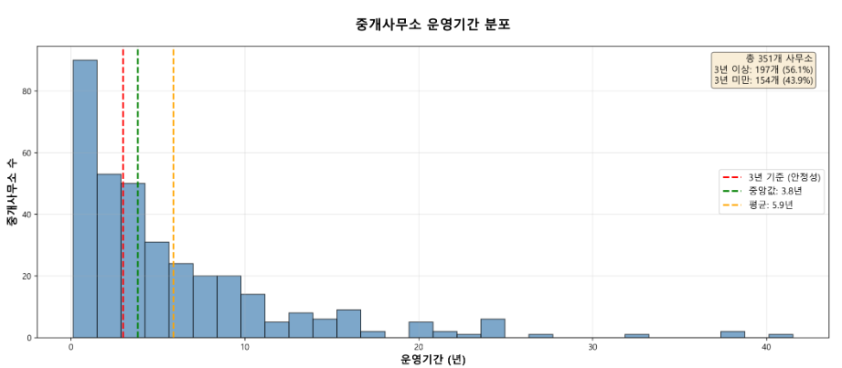
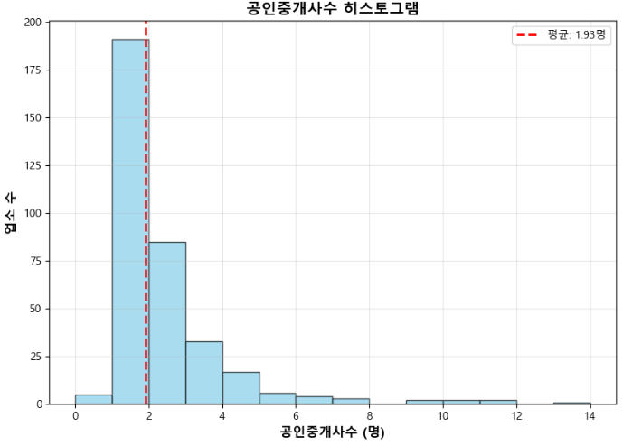

# 🏢 중개사 신뢰도 평가 다중분류 모델 (Trust Model)

### 🎯 **목적**
부동산 중개사의 신뢰도를 **A/B/C 등급**으로 분류하는 ML

### 1. 📊 **데이터**
[서울특별시 중개사 정보]

- 크롤링 데이터의 중개소 정보
- V-WORLD API 중개업소 정보
- V-WORLD API 중개업자 정보 

### 1-1. 📊 **사용한 데이터 주요 정보**
**1️⃣ 크롤링한 매물 중개사 정보**
| 컬럼명 | 설명 | 출처 |
|--------|------|------|
| 중개사무소명 | 중개사무소 이름 | 크롤링 |
| 대표자 | 대표자 이름 | 크롤링 |
| 전화번호 | 연락처 | 크롤링 |
| 주소 | 사무소 주소 | 크롤링 |
| 등록번호 | 사업자등록번호 | 크롤링 |
| 거래완료 | 완료된 거래 건수 | 크롤링 |
| 등록매물 | 현재 등록된 매물 수 | 크롤링 |

**2️⃣ V-WORLD API 중개업소 정보**
| 컬럼명 | 설명 | 출처 |
|--------|------|------|
| jurirno | 등록번호 | API (office) |
| brkrNm | 대표자 이름 | API (office) |
| bsnmCmpnm | 중개사무소 이름 | API (office) |
| sttusSeCode | 상태구분 코드 (1:영업중,2:휴업,3:휴업연정,4:실효5:폐업,6:전출,7:등록취소,8:업무정지) | API (office) |
| registDe | 등록일자 | API (office) |
| ldCodeNm | 지역 | API (office) |
| estbsBeginDe | 보증보험 시작일 | API (office) |
| estbsEndDe | 보증보험 종료일 | API (office) |

**3️⃣ V-WORLD API 중개업자 정보**
| 컬럼명 | 설명 | 출처 |
|--------|------|------|
| jurirno | 법인등록번호 | API (brokers) |
| bsnmCmpnm | 사업자 상호 | API (brokers) |
| brkrNm | 중개업자 이름 | API (brokers) |
| brkrAsortCode | 중개보조원, 공인중개사, 법인, 중개인 | API (brokers) |
| crqfcAcqdt | 자격증 취득일자 | API (brokers) |
| crqfcNo | 자격증번호 | API (brokers) |
| ofcpsSeCodeNm | 대표, 일반 | API (brokers) |

### 1-2. 📊 **데이터 통합 과정**

**Step 1: 크롤링 데이터 + V-WORLD 중개업소 정보 매칭**
- **매칭 키**: `중개사무소명 + 대표자명`
- **목적**: 크롤링한 중개사 정보에 V-WORLD API의 중개업소 정보결합
- **결과**: 크롤링 데이터에 중개업소의 정보 추가

**Step 2: Step 1 결과 + V-WORLD 중개업자 정보 매칭 (1차)**
- **매칭 키**: `등록번호 + 중개사무소명`
- **목적**: 각 중개사무소에 소속된 공인중개사, 중개보조원 등 직원 정보 추가
- **결과**: 중개사무소별 인력 구성 정보 확보 (공인중개사 수, 중개보조원 수 등)

**Step 3: 2차 매칭 (보완)**
- **매칭 키**: `중개사무소명 + 대표자명` (1차 매칭 실패 시)
- **목적**: 등록번호가 불일치하거나 누락된 경우에도 중개업자 정보 최대한 확보
- **추가 처리**: 2차 매칭된 중개사무소의 모든 직원 정보 저장
- **최종 결과**: **351개 중개사무소**의 통합 데이터 생성


### **2. 🎯 신뢰도 등급(Target) 산출 로직 (데이터 누수 방지)**

#### **타겟**: 신뢰도 등급 (A/B/C)

### 2-1. **올바른 파이프라인 순서**

**🚨 중요: 데이터 누수(Data Leakage) 방지를 위한 올바른 순서**

```
1️⃣ Raw Data
2️⃣ 기본 클렌징 (NaN, 타입 변환)
3️⃣ Train / Test Split
4️⃣ [Train 기준]
   - 지역 평균 / 표준편차 계산
   - 자격점수 평균 / 표준편차 계산
   - Z-score → target 생성
5️⃣ [Test 기준]
   - Train에서 계산한 값으로만 Z-score 적용
6️⃣ Feature 생성
7️⃣ 모델 학습 / 평가
```

### 2-2. **Target 생성 프로세스**

**1️⃣ 거래성사율 계산**
```python
거래성사율 = 거래완료 / (거래완료 + 등록매물)
```
- **의미**: 전체 거래 활동 중 실제로 성사된 비율

**2️⃣ Train 기준 지역별 표준화 (Z-score)**
```python
# Train 데이터에서만 통계 계산
train_regional_stats = train_df.groupby("지역명")["거래성사율"].agg(['mean', 'std'])

# Train과 Test 모두에 Train 통계 적용
Z_score = (거래성사율 - train_지역평균) / train_지역표준편차
```

- **목적**: 지역별 시장 특성 차이를 보정
- **핵심**: Test 데이터 정보가 Train 과정에 누수되지 않도록 Train 통계만 사용

**3️⃣ Train 기준 자격점수 표준화**
```python
# Train 데이터에서만 자격점수 통계 계산
train_qual_mean = train_df["자격점수"].mean()
train_qual_std = train_df["자격점수"].std()

# Train과 Test 모두에 Train 통계 적용
Qual_Zscore = (자격점수 - train_qual_mean) / train_qual_std
```

**4️⃣ 복합 Z-score 및 가중치 적용**
```python
# 성사율 80% + 자격 20%
Zscore = (Performance_Zscore * 0.8) + (Qual_Zscore * 0.2)

# 대표자구분 가중치
대표자구분_가중치 = {
    '공인중개사': 0.0,     # 기준
    '법인': +0.2,          # 가점 (조직 안정성)
    '중개보조원': -0.1,    # 감점 (자격 수준)
    '중개인': -0.3         # 감점 (자격 수준)
}

Zscore_조정 = Zscore + 대표자구분_가중치
```

**5️⃣ Train 기준 분위수로 등급 분류**
```python
# Train 데이터에서만 분위수 계산
q30 = train_df["Zscore_조정"].quantile(0.30)
q70 = train_df["Zscore_조정"].quantile(0.70)

# Train과 Test 모두에 동일한 기준 적용
def classify_grade(z):
    if z <= q30: return "C"      # 하위 30%
    elif z <= q70: return "B"    # 중위 40%
    else: return "A"             # 상위 30%
```

#### **최종 타겟 분포**
| 등급 | 비율 | 개수 | 의미 |
|------|------|------|------|
| **A등급** | 30.2% | 106개 | 우수 중개사 |
| **B등급** | 39.9% | 140개 | 보통 중개사 |
| **C등급** | 29.9% | 105개 | 개선 필요 중개사 |

---

### **3. 피처 엔지니어링** 🏗️

**🔴 거래 지표 (2개)**
```python
# 로그 변환을 통한 스케일 조정
등록매물_log = np.log1p(등록매물)
총거래활동량_log = np.log1p(거래완료 + 등록매물)
```

**💡 로그 변환 이유:**
1. **왜도(Skewness) 해소**: 거래량 데이터는 극단적으로 치우친 분포 (소수가 매우 많고, 대다수가 적음)
2. **이상치 영향 감소**: 거래량 1000건과 10건의 차이를 완화 (log(1000)≈6.9, log(10)≈2.3)
3. **스케일 정규화**: 다른 피처들(0~1 범위)과 비슷한 스케일로 조정하여 모델 학습 안정화


**🟢 인력 지표 (3개)**
```python
총_직원수
공인중개사수
공인중개사_비율 = 공인중개사수 / 총_직원수
```

**🟡 운영 경험 (4개)**
```python
운영기간_년 = (현재날짜 - 등록일) / 365.25
운영경험_지수 = np.exp(운영기간_년 / 10)
숙련도_지수 = 운영기간_년 * 공인중개사_비율 # 오래운영하고 공인중개사가 많을수록 높은 숙련도
운영_안정성 = (운영기간_년 >= 3).astype(int)  # 3년 이상 = 안정
```

* 중앙값(3.8년) 기준으로 안정적 운영 경험 구분

**🔵 조직 구조 (2개)**
```python
대형사무소 = (총_직원수 >= 2).astype(int)
직책_다양성 = 직책_종류_수  # 공인중개사, 중개보조원, 대표, 일반직원
```

* 총_직원수 평균이 1.93명으로, 2명을 기준으로 평균 이상의 조직 규모 구분

**🟣 대표자 구분 (4개)**
```python
# 범주형 변수를 이진 변수로 변환
대표_공인중개사 = (대표자구분명 == "공인중개사").astype(int)
대표_법인 = (대표자구분명 == "법인").astype(int)
대표_중개인 = (대표자구분명 == "중개인").astype(int)
대표_중개보조원 = (대표자구분명 == "중개보조원").astype(int)
```

#### 피처 요약
| 피처 그룹 | 개수 | 설명 |
|----------|------|------|
| 거래 지표 | 2개 | 거래 실적 관련 피처 (로그 변환) |
| 인력 지표 | 3개 | 직원 구성 및 전문성 |
| 운영 경험 | 4개 | 사업 운영 기간 및 안정성 |
| 조직 구조 | 2개 | 조직 규모 및 다양성 |
| 대표자 구분 | 4개 | 대표자 자격 |


---

### **4. 모델학습** 🤖

#### 하이퍼파라미터 최적화

**GridSearchCV로 144개 조합 탐색:**
```python
# 탐색 범위
param_grid = {
    'C': [0.001, 0.01, 0.1, 1, 10, 100],
    'penalty': ['l1', 'l2'],
    'solver': ['liblinear', 'saga'],
    'class_weight': [None, 'balanced'],
    'max_iter': [1000, 2000]
}

# 결과: CV 정확도 68.93% → 83.21% (14.28%p 향상)
```

#### 최적 모델: Logistic Regression
```python
model = LogisticRegression(
    C=1,                      # 정규화 강도 (GridSearchCV 최적값)
    penalty='l1',             # L1 정규화 (피처 선택 효과)
    solver='saga',            # L1 지원 solver
    class_weight='balanced',  # 클래스 불균형 처리
    max_iter=1000,            # 충분한 반복
    random_state=42           # 재현성 확보
)
```

**최적 하이퍼파라미터 선택 이유**
- ✅ **C=1**: 정규화 완화로 모델 표현력 향상 (0.01 → 1)
- ✅ **penalty='l1'**: 불필요한 피처 자동 제거 (L2 → L1)
- ✅ **solver='saga'**: L1 정규화 지원 및 빠른 수렴
- ✅ **class_weight='balanced'**: A/B/C 등급 불균형 자동 조정

#### 데이터 분할

- **Train/Test 분할**: 8:2 비율로 분할 (stratify로 등급 비율 유지)
- **표준화**: StandardScaler를 사용하여 평균 0, 표준편차 1로 정규화

#### 교차 검증

- **방법**: 5-Fold Stratified Cross-Validation (등급 비율 유지)
- **결과**: CV Mean 66.79% (±5.00%)

---

### **5. 모델 성능 평가** 📊

#### 🎯 최종 성능 지표

```
  Test Accuracy:   84.51%            
  Train Accuracy:  85.71%           
  과적합 정도:      1.21%
  CV Mean:         83.21% (±3.11%)   
  CV vs Test:     -1.29%             
```

#### 📈 등급별 상세 성능

| 등급 | Precision | Recall | F1-Score | 해석 |
|------|-----------|--------|----------|------|
| **A등급** | 0.84 | **0.95** | 0.89 | 높은 재현율 → 우수 중개사 잘 찾음 ✅ |
| **B등급** | **0.95** | 0.64 | 0.77 | 정밀도 우수, 재현율 개선 필요 ⚠️ |
| **C등급** | 0.78 | **1.00** | 0.88 | 완벽한 재현율 → 문제 사무소 완벽 감지 ✅ |

- Precision (정밀도): "모델이 A등급이라고 예측한 것 중, 실제로 A등급인 비율"
- Recall (재현율): "실제 A등급인 것 중, 모델이 A등급이라고 예측한 비율"
- F1-Score: Precision과 Recall의 둘 다 고려한 균형 지표

#### 📊 혼동 행렬 (Confusion Matrix)


---

### **6. SHAP 분석** 🔍

#### 📋 A등급 - 주요 피처 (중요도 순)

```
1. 총거래활동량_log      3.3907
2. 등록매물_log          2.6911
3. 총_직원수             0.3445
4. 운영_안정성           0.3030
5. 공인중개사수          0.0341
6. 대표_법인             0.0041
```


#### 📋 B등급 - 주요 피처 (중요도 순)

```
1. 운영경험_지수         0.0775
2. 공인중개사_비율       0.0384
3. (나머지 피처 모두 0.0000)
```


#### 📋 C등급 - 주요 피처 (중요도 순)

```
1. 총거래활동량_log      5.7141
2. 등록매물_log          4.3112
3. 운영_안정성           0.2771
4. 공인중개사수          0.1907
5. 총_직원수             0.1884
6. 직책_다양성           0.1285
7. 운영기간_년           0.1125
```


**✅ 인사이트**: 
- **A등급**: 거래 실적(총거래활동량, 등록매물)이 가장 중요
- **C등급**: 거래 실적 외에도 조직 구조(직책다양성, 공인중개사수)가 영향
- **B등급**: L1 정규화로 대부분 피처가 0, 운영경험_지수와 공인중개사_비율만 유의미
→ 가중치 조정 필요


## 📁 프로젝트 구조

```
apps/reco/models/trust_model/
├── 📂 data_preprocessing/          # 데이터 전처리
│   ├── _00_load_Landbroker.py     # 크롤링 데이터 로드
│   ├── _01_load_broker.py         # V-WORLD 중개업자 정보 로드
│   ├── _02_load_brokerOffice.py   # V-WORLD 중개업소 정보 로드
│   ├── _03_merge_all_brokers.py   # 데이터 통합 (3단계 매칭)
│   ├── _04_clean_broker.py        # 데이터 클렌징
│   └── _05_group_by_office.py     # 중개사무소별 집계
│
├── 📂 pipeline/                    # 모델 파이프라인 (데이터 누수 방지)
│   ├── _00_load_data.py           # 데이터 로드 및 기본 클렌징
│   ├── _01_create_target.py       # Train/Test Split + Target 생성
│   ├── _02_create_features.py     # Train 기준 Feature 생성
│   ├── _03_train.py               # 모델 학습 (GridSearchCV)
│   ├── _04_eval.py                # 모델 평가
│   └── _05_save_model.py          # 최종 모델 저장
│
├── 📂 analysis/                    # 분석 스크립트 (11개)
│   ├── analyze_shap.py                        # SHAP 피처 중요도 분석
│   ├── analyze_grade_changes.py               # 자격별 등급 변화 분석
│   ├── feature_engineering_eda.py             # 피처 엔지니어링 EDA
│   ├── feature_correlation_analysis.py        # 피처 상관관계 분석
│   ├── model_validation_analysis.py           # 모델 검증 (혼동행렬, 상관관계)
│   ├── operating_period_statistics.py         # 운영기간 통계 분석
│   ├── target_distribution_analysis.py        # 타겟 생성 과정 시각화
│   ├── presentation_materials.py              # 발표용 종합 분석
│   ├── visualize_qualification_weight.py      # 자격점수 가중치 효과
│   ├── visualize_transaction_rate_evidence.py # 거래성사율 근거 시각화
│   └── results/                               # 분석 결과 저장
│
├── 📂 model/                       # 학습된 모델
│   ├── final_trust_model.pkl      # 최종 배포 모델
│   ├── temp_trained_models.pkl    # 전체 학습 결과
│   └── model_eval_results.csv     # 평가 결과
│
├── 📂 notebooks/                   # Jupyter 노트북
│   └── trust_model_analysis.ipynb
│
├── 📄 run_all.py                   # 전체 파이프라인 실행
└── 📄 README.md                    # 이 문서
```

---

## 🚀 실행 방법

### 1️⃣ 데이터 수집 및 전처리
```bash
# 순서대로 실행
python apps/reco/models/trust_model/data_preprocessing/_00_load_Landbroker.py
python apps/reco/models/trust_model/data_preprocessing/_01_load_broker.py
python apps/reco/models/trust_model/data_preprocessing/_02_load_brokerOffice.py
python apps/reco/models/trust_model/data_preprocessing/_03_merge_all_brokers.py
python apps/reco/models/trust_model/data_preprocessing/_04_clean_broker.py
python apps/reco/models/trust_model/data_preprocessing/_05_group_by_office.py
```

### 2️⃣ 전체 파이프라인 실행 (학습)
```bash
python apps/reco/models/trust_model/run_all.py
```
→ 데이터 로드 → Target 생성 → Feature 생성 → 학습 → 평가 → 모델 저장

### 3️⃣ 분석 실행

#### 📊 기본 분석
```bash
# SHAP 피처 중요도 분석
python apps/reco/models/trust_model/analysis/analyze_shap.py

# 모델 검증 분석 (혼동행렬, 상관관계 히트맵)
python apps/reco/models/trust_model/analysis/model_validation_analysis.py

# 피처 엔지니어링 근거 EDA
python apps/reco/models/trust_model/analysis/feature_engineering_eda.py
```

#### 📈 심화 분석
```bash
# 타겟 생성 과정 시각화
python apps/reco/models/trust_model/analysis/target_distribution_analysis.py

# 자격점수 가중치 적용 효과
python apps/reco/models/trust_model/analysis/visualize_qualification_weight.py

# 거래성사율 근거 시각화
python apps/reco/models/trust_model/analysis/visualize_transaction_rate_evidence.py

# 자격별 등급 변화 분석
python apps/reco/models/trust_model/analysis/analyze_grade_changes.py

# 운영기간 통계 분석
python apps/reco/models/trust_model/analysis/operating_period_statistics.py

# 피처 상관관계 분석
python apps/reco/models/trust_model/analysis/feature_correlation_analysis.py
```

#### 🎯 발표 자료 생성
```bash
# 종합 분석 자료 (5개 차트)
python apps/reco/models/trust_model/analysis/presentation_materials.py
```

### 4️⃣ 예측 실행
```bash
# DB의 모든 중개사에 대해 신뢰도 등급 예측
python scripts/trust_prediction/predict_trust_scores.py
```

---

## 📊 분석 결과물

### 생성되는 시각화 파일 (총 20개 이상)

**analysis/results/** 디렉토리에 저장:

1. **타겟 분석** (2개)
   - `00_target_distribution.png` - 타겟 생성 과정
   - `00_target_zscore_comparison.png` - 등급별 Z-Score 비교

2. **모델 성능** (5개)
   - `01_model_performance.png` - 종합 성능 분석
   - `01_confusion_matrix.png` - 혼동 행렬
   - `02_feature_importance.png` - 피처 중요도
   - `03_grade_comparison.png` - 등급별 특성 비교
   - `04_error_analysis.png` - 예측 오류 분석

3. **피처 분석** (7개)
   - `01_transaction_analysis.png` - 거래 지표 분석
   - `02_certification_analysis.png` - 자격증 분석
   - `03_experience_analysis.png` - 경험 분석
   - `04_organization_analysis.png` - 조직 구조 분석
   - `05_location_analysis.png` - 지역 분석
   - `02_feature_target_correlation_bar.png` - 피처-타겟 상관관계
   - `03_feature_correlation_heatmap.png` - 피처 간 상관관계

4. **자격점수 효과** (4개)
   - `05_qualification_weight_comparison.png` - 자격별 비교
   - `06_overall_qualification_comparison.png` - 전체 비교
   - `07_qualification_score_distribution.png` - 자격점수 분포
   - `08_grade_change_table_by_qualification.png` - 등급 변화 표

5. **거래성사율 근거** (4개)
   - `01_scatter_listings_vs_transactions.png` - 산점도
   - `02_grade_comparison.png` - 등급별 비교
   - `03_quadrant_analysis.png` - 사분면 분석
   - `04_correlation_heatmap.png` - 상관관계

6. **SHAP 분석** (3개)
   - `shap_importance_0.png` - C등급 피처 중요도
   - `shap_importance_1.png` - B등급 피처 중요도
   - `shap_importance_2.png` - A등급 피처 중요도

7. **기타** (2개)
   - `10_detailed_grade_change_analysis.png` - 등급 변화 상세
   - `grade_change_details.csv` - 등급 변화 데이터

---

## 🎯 주요 개선 사항

### ✅ 데이터 누수 방지
- Train/Test Split 후 Train 데이터 기준으로만 통계 계산
- Test 데이터는 Train 통계를 사용하여 변환

### ✅ 피처 엔지니어링
- 로그 변환으로 왜도 해소 (3.96 → 0.14)
- 14개 피처로 신뢰도 예측 (거래, 인력, 경험, 조직, 자격)

### ✅ 하이퍼파라미터 최적화
- GridSearchCV로 144개 조합 탐색
- CV 정확도 68.93% → 83.21% (14.28%p 향상)

### ✅ 종합 분석 도구
- 11개 분석 스크립트로 모델 해석 가능성 확보
- 20개 이상의 시각화 자료 자동 생성

---

## 📝 향후 개선 계획

1. **데이터 확장**
   - 네이버 부동산, 직방, 다방 등 추가 플랫폼 데이터 수집
   - 리뷰, 평점 등 사용자 피드백 데이터 통합

2. **피처 추가**
   - 지역별 경쟁 강도 (실제 계산)
   - 시간대별 거래 패턴
   - 전문 분야 (아파트, 오피스텔 등)

3. **모델 개선**
   - 앙상블 모델 (XGBoost, CatBoost) 테스트
   - 딥러닝 모델 (TabNet) 실험

4. **배포 최적화**
   - 모델 경량화 (ONNX 변환)
   - 실시간 예측 API 구축
