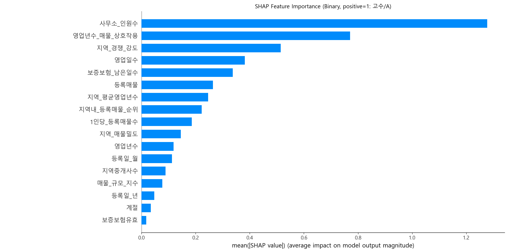
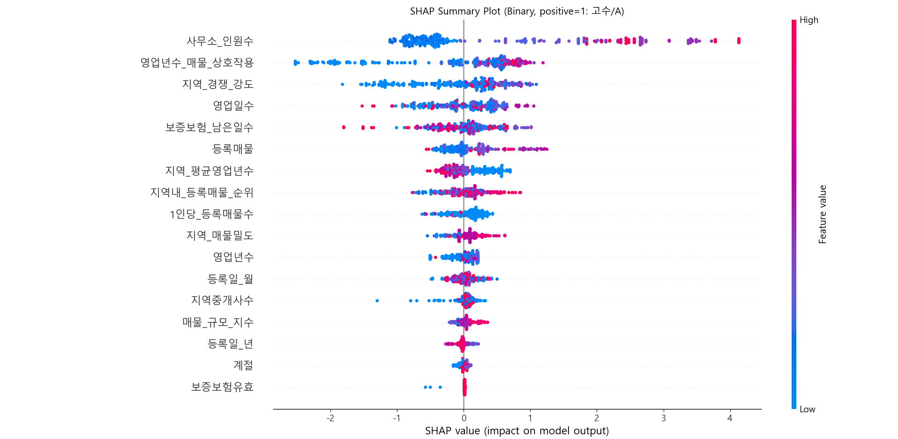

# 🏗️ 중개사 신뢰도 예측 모델 (Binary Classification)

본 문서는 거래성사율 90% 이상 = 고수(A) 를 기준으로 학습된
이진분류 중개사 신뢰도 모델의 SHAP 분석 내용 정리

## 🧪 이진분류 SHAP 분석
### 🔥 Bar Plot: 핵심 피처 중요도
- 모델이 ‘고수(A)’ 판정을 내릴 때 가장 많이 참고한 변수 순위
- 즉, 규모 · 경험 · 지역 경쟁력 · 운영 안정성이 가장 강력한 기준이라는 뜻
  

| 순위    | 피처명              | 해석                                 |
| ----- | ---------------- | ---------------------------------- |
| **1** | **사무소_인원수**      | 직원 수가 많을수록 “고수/성과 우수” 확률이 매우 높음    |
| **2** | **영업년수_매물_상호작용** | 오래 영업하며 매물을 적극적으로 다룬 사무소가 고수로 분류됨  |
| **3** | **지역_경쟁_강도**     | 경쟁이 치열한 지역에서 성과를 내는 중개사가 고수로 판단됨   |
| **4** | **영업일수**         | 오래 운영할수록 신뢰도 상승, 고수(A) 가능성 증가      |
| **5** | **보증보험_남은일수**    | 보험기간이 넉넉하게 남아 있는 사무소일수록 안정적 → 신뢰도↑ |

### 🎨 Summary Plot: 피처별 영향력(방향성) 분석
  
- 빨간색(High): 피처 값이 높은 중개사
- 파란색(Low): 피처 값이 낮은 중개사
- X축(→): SHAP value → 고수(A=1) 확률 상승
- X축(←): 신입(B=0) 확률 상승
- 즉, 오른쪽으로 갈수록 고수(A) 쪽에 가까워지는 신호, 왼쪽으로 갈수록 신입(B) 쪽에 가까워지는 신호

## 🔍 주요 피처 상세 해석
📌 1) 사무소_인원수 (가장 강력한 결정 요인)
- 직원 수가 많으면 빨간 점이 오른쪽에 강하게 몰림  
→ 조직 규모가 있을수록 고수(A) 판정
- 반대로 1~2인 소규모 사무소는 신입(B) 측으로 밀림  
➡ 규모는 신뢰도 판단의 가장 강력한 변수

📌 2) 영업년수_매물_상호작용
(영업 경력 × 매물 처리량)
- 영업기간 + 매물 처리량이 함께 많으면 오른쪽(고수)
- 짧은 경력 + 적은 매물 → 왼쪽(B)로 이동  
➡ 단순 경력보다 ‘경험 × 매물 처리 능력’의 조합이 핵심

📌 3) 지역_경쟁_강도
- 경쟁이 치열한 지역일수록 빨간 점이 오른쪽에 몰림
- 즉 경쟁 지역에서 살아남는 중개사가 고수로 평가됨  
➡ 고수 중개사는 치열한 시장에서도 잘 버틸 수 있는 구조

📌 4) 영업일수
- 오래 운영한 사무소일수록 고수 확률 ↑
- 신규 사무소는 주로 왼쪽(B)에 위치 → 고수 가능성 낮음  
➡ 지속 운영 = 신뢰도 핵심 지표

📌 5) 보증보험_남은일수
- 보증보험 남은 기간이 길면 고수로 이동
- 보험 만료가 가까우면 B로 분류되기 쉬움  
➡ 재무 안정성 & 신뢰 기반 영업이 중요함

## 📁 기타 피처 해석 요약
| 피처명                    | 설명                                     |
| ---------------------- | -------------------------------------- |
| **등록매물**               | 매물 수가 많을수록 고수 경향 (활동성 지표)              |
| **지역_평균영업년수**          | 지역 평균보다 오래된 사무소가 우수 판정 받기 쉽다           |
| **지역내_등록매물_순위**        | 지역 내 매물 점유율이 높으면 경쟁력 반영 → 고수↑          |
| **지역_매물밀도**            | 주변 매물 밀도가 높으면 경쟁력·활동성 중요               |
| **1인당_등록매물수**          | 직원 1명당 처리 매물이 많을수록 고수 경향               |
| **영업년수**               | 기본적인 경력 역시 평가에 영향                      |
| **매물_규모_지수**           | 다루는 매물의 규모가 클수록 고수 경향                  |
| **등록일_월 / 등록일_년 / 계절** | 영향력은 낮지만 패턴 존재                         |
| **보증보험유효**             | 유효보험(1)은 오른쪽, 미유효(0)는 왼쪽에 몰림 → B 판정 증가 |

## 📌 총평: 모델이 학습한 ‘고수 중개사’의 특징

- 이 모델은 실제 업계에서도 중요한 기준을 정확하게 학습함
### 🏆 고수(A) 중개사의 공통점
- 직원 수가 많고 조직력이 있음
- 경험이 풍부하고 매물 처리 능력이 높음
- 경쟁 치열한 지역에서도 성과 냄
- 보증보험이 잘 유지되고 운영이 안정적
- 지속적이고 균형 있는 매물 관리가 이루어짐  
➡ 거래성사율 90% 이상의 ‘진짜 우수 중개사’ 패턴을 잘 반영한 모델