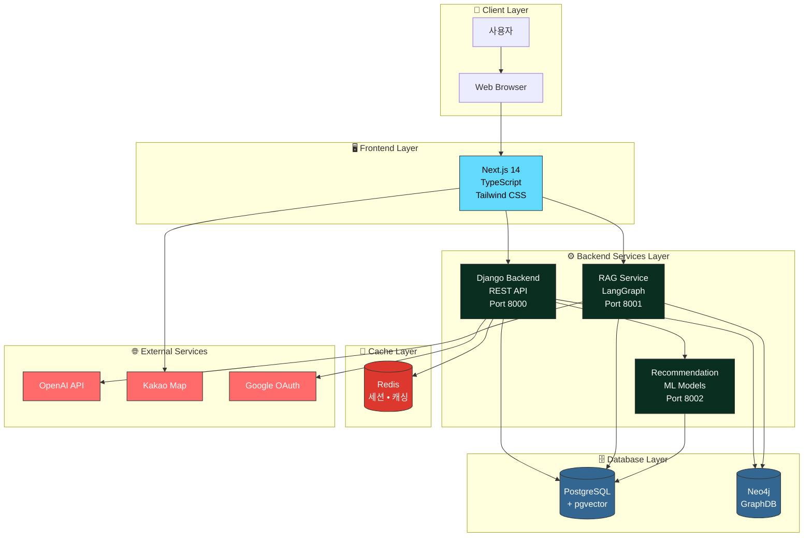
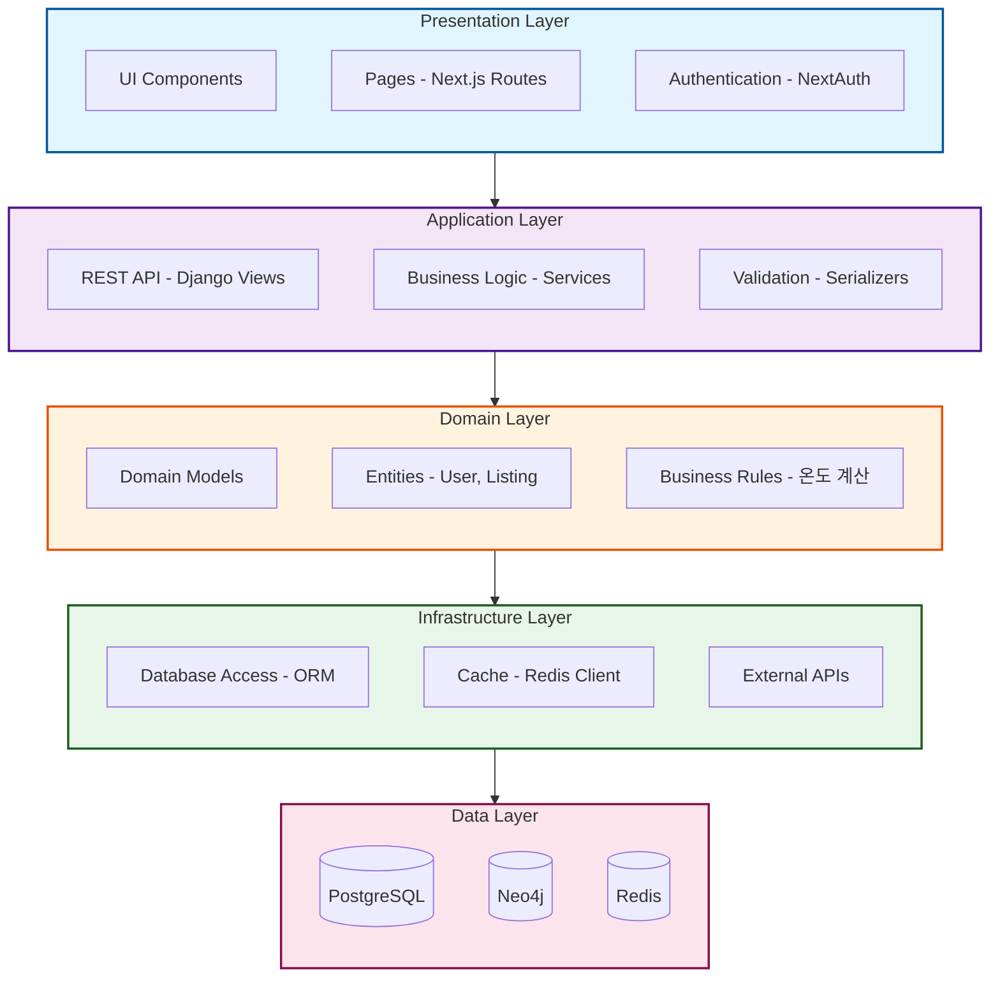
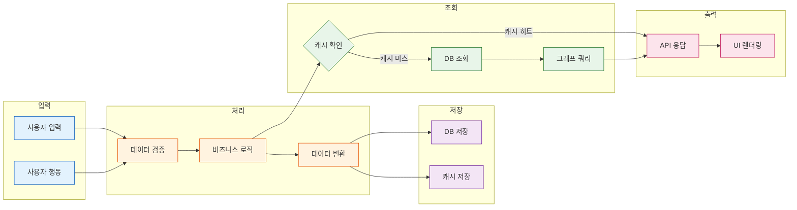
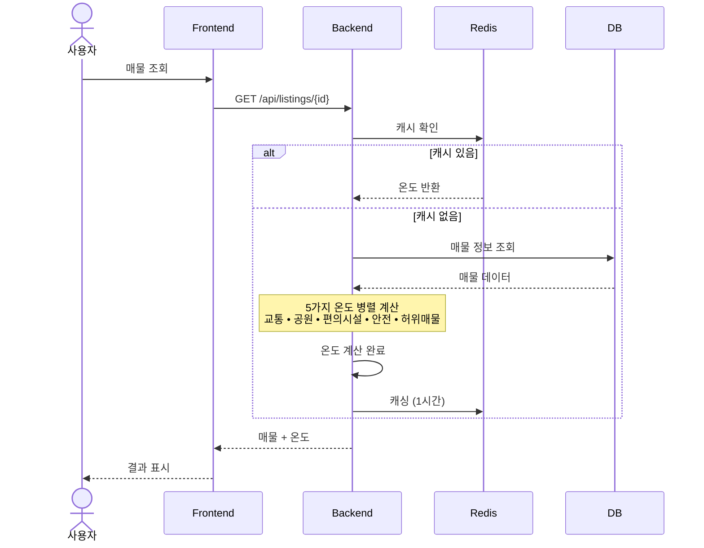
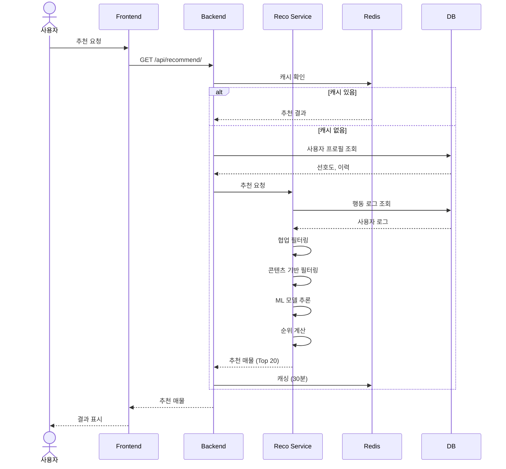
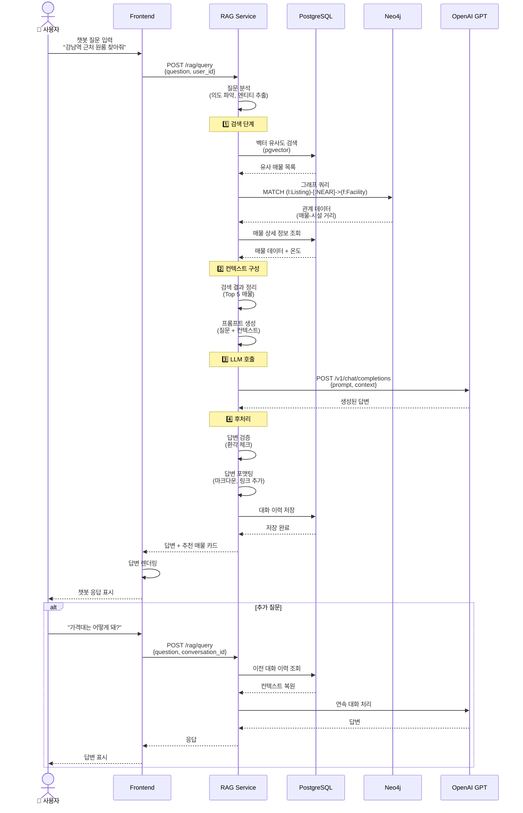
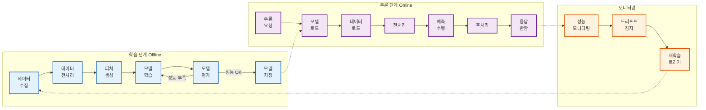
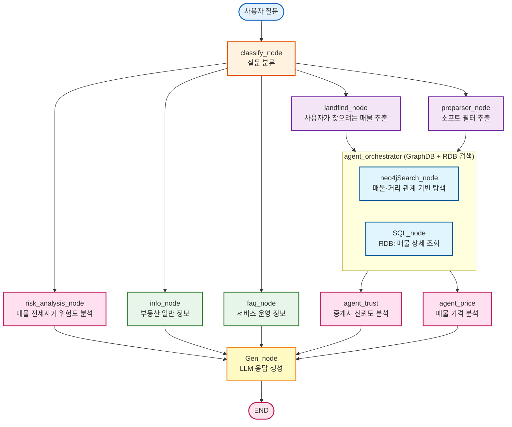
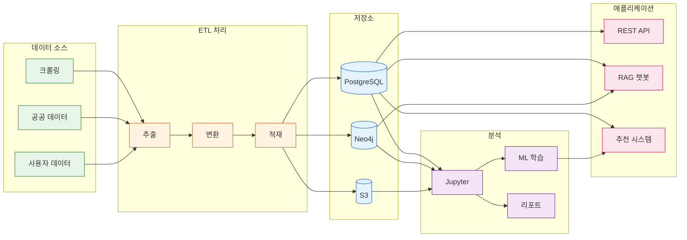

# 🏗️ 전체 시스템 아키텍처 다이어그램

## 1. 전체 시스템 아키텍처

---

## 2. Layered Architecture (계층형 아키텍처)

---

## 3. 데이터 흐름도 (Data Flow Diagram)

---

## 4. 온도 계산 시퀀스 다이어그램

---

## 5. 추천 시스템 시퀀스 다이어그램

---

## 6. RAG 챗봇 시퀀스 다이어그램

---

## 7. ML 모델 동작 흐름

---

## 8. LangGraph RAG 구조

### LangGraph 노드 설명

| 노드 | 역할 | 설명 |
|------|------|------|
| **classify_node** | 질문 분류 | 사용자 질문의 의도를 파악하여 적절한 노드로 라우팅 |
| **risk_analysis_node** | 전세사기 위험도 분석 | 매물의 전세사기 위험도 분석 |
| **landfind_node** | 매물 추출 | 사용자가 찾으려는 매물 정보 추출 |
| **preparser_node** | 소프트 필터 추출 | 질문에서 주관적 조건 추출 (깨끗한, 조용한, 밝은 등) 예: "강남역 근처 깨끗한 방" → 소프트 필터: 깨끗함 |
| **info_node** | 부동산 정보 | 부동산 관련 일반 정보 제공 |
| **faq_node** | FAQ | 서비스 운영 관련 자주 묻는 질문 처리 |
| **agent_trust** | 신뢰도 분석 | 중개사 신뢰도 분석 |
| **agent_price** | 가격 분석 | 매물 가격 적정성 분석 |
| **agent_orchestrator** | 검색 오케스트레이터 | GraphDB와 RDB를 병렬로 검색 조율 |
| **neo4jSearch_node** | 그래프 검색 | Neo4j에서 매물-거리-관계 기반 탐색 |
| **SQL_node** | RDB 검색 | PostgreSQL에서 매물 상세 정보 조회 |
| **Gen_node** | LLM 응답 생성 | LLM을 호출하여 최종 답변 생성 (위험도 분석, 가격 적정성, 추천 매물 등) |

---

## 9. 전체 데이터 파이프라인

---

## 📊 다이어그램 요약

| 다이어그램 | 목적 | 주요 내용 |
|-----------|------|-----------|
| **전체 시스템 아키텍처** | 시스템 전체 구조 | 계층별 컴포넌트 및 연결 관계 |
| **Layered Architecture** | 계층형 구조 | Presentation → Application → Domain → Infrastructure → Data |
| **데이터 흐름도** | 데이터 처리 과정 | 입력 → 처리 → 저장 → 조회 → 출력 |
| **온도 계산 시퀀스** | 온도 계산 흐름 | 5가지 온도 병렬 계산 및 캐싱 |
| **추천 시스템 시퀀스** | 추천 알고리즘 | 협업 필터링 + 콘텐츠 기반 + ML 모델 |
| **RAG 챗봇 시퀀스** | 챗봇 동작 원리 | 검색 → 컨텍스트 구성 → LLM 호출 → 답변 생성 |
| **ML 모델 동작** | 모델 학습/추론 | 학습 → 저장 → 로드 → 추론 → 모니터링 |
| **LangGraph RAG 구조** | RAG 그래프 구조 | 질문 분류 → 병렬 검색 → 답변 생성 |
| **데이터 파이프라인** | 데이터 흐름 전체 | 수집 → ETL → 저장 → 분석 → 애플리케이션 |
