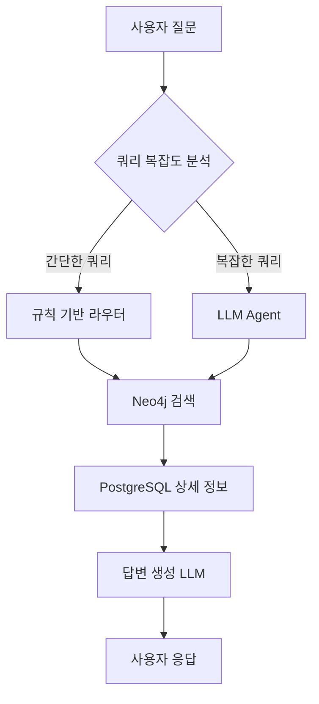
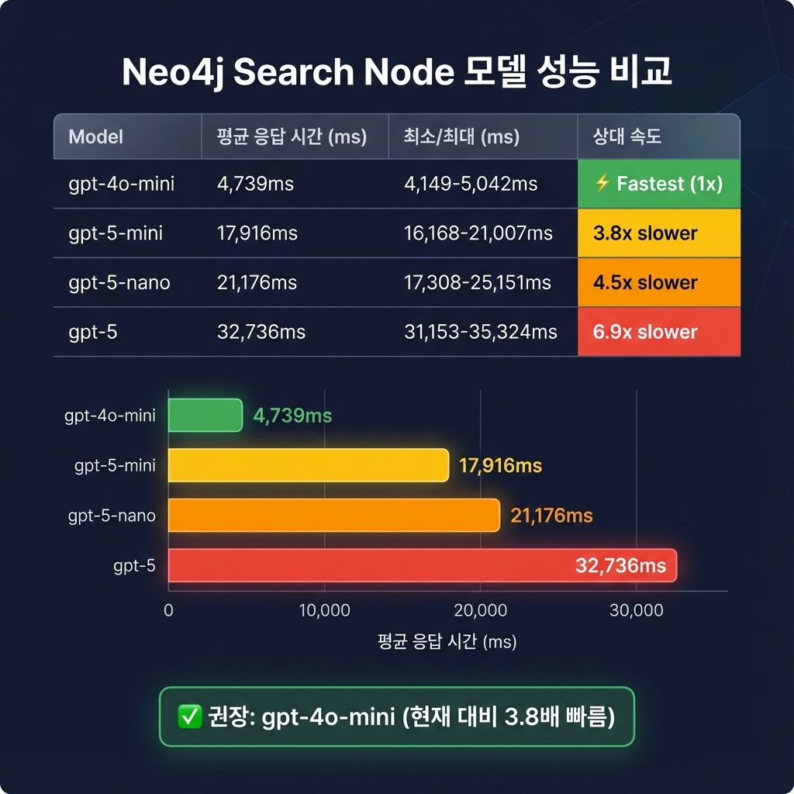
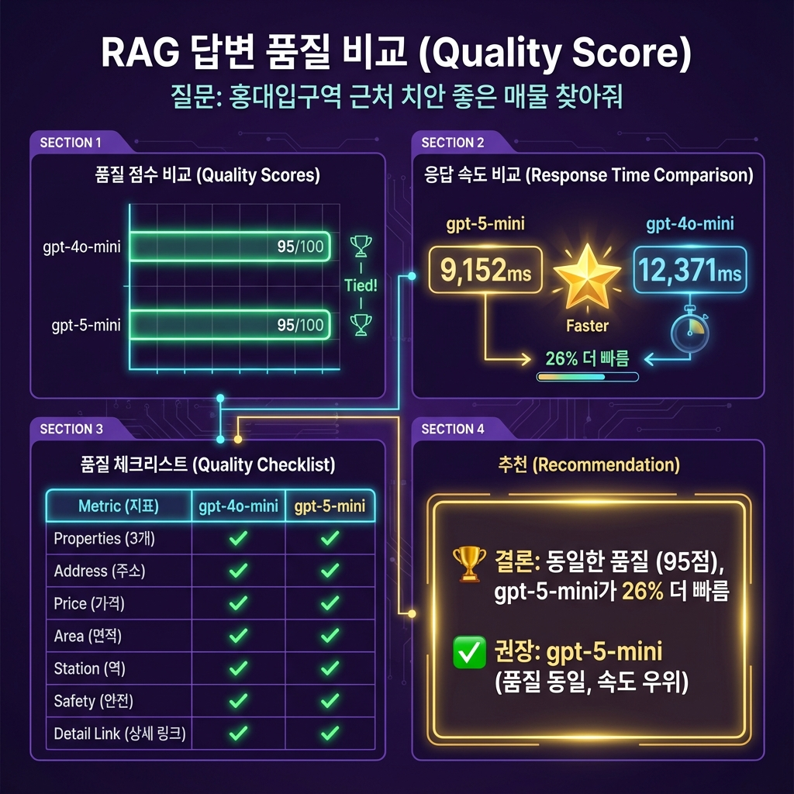

# 🔍 Neo4j 기반 부동산 매물 검색 시스템

> **문서 작성일**: 2025-12-16  
> **목적**: Neo4j 그래프 데이터베이스를 활용한 부동산 매물 검색 시스템의 구조와 원리 설명

---

## 📊 목차

1. [Neo4j 데이터 구조](#1-neo4j-데이터-구조)
2. [거리 기준 설정](#2-거리-기준-설정)
3. [챗봇 검색 프로세스](#3-챗봇-검색-프로세스)
4. [하이브리드 라우터 원리](#4-하이브리드-라우터-원리)
5. [모델 벤치마크 결과](#5-모델-벤치마크-결과)

---

## 1. Neo4j 데이터 구조

### 1.1 노드 (Nodes)

| 노드 타입         | 설명              | 주요 속성    |
| ----------------- | ----------------- | ------------ |
| `Property`        | 부동산 매물       | id, lat, lon |
| `SubwayStation`   | 지하철역          | name, line   |
| `Hospital`        | 병원              | name, type   |
| `GeneralHospital` | 종합병원/대학병원 | name         |
| `Pharmacy`        | 약국              | name         |
| `Convenience`     | 편의점            | name, brand  |
| `Park`            | 공원              | name         |
| `College`         | 대학교            | name         |
| `Police`          | 경찰서            | name         |
| `FireStation`     | 소방서            | name         |
| `CCTV`            | CCTV              | location     |
| `EmergencyBell`   | 비상벨            | location     |

> [!NOTE] > `Property` 노드는 **id와 좌표(lat, lon)만** 저장합니다.  
> 주소, 가격 등 상세 정보는 **PostgreSQL**에서 조회합니다.

### 1.2 관계 (Relationships)

```
(Property)-[:NEAR_SUBWAY]->(SubwayStation)
(Property)-[:NEAR_HOSPITAL]->(Hospital)
(Property)-[:NEAR_GENERAL_HOSPITAL]->(GeneralHospital)
(Property)-[:NEAR_PHARMACY]->(Pharmacy)
(Property)-[:NEAR_CONVENIENCE]->(Convenience)
(Property)-[:NEAR_PARK]->(Park)
(Property)-[:NEAR_COLLEGE]->(College)
(Property)-[:NEAR_POLICE]->(Police)
(Property)-[:NEAR_FIRE]->(FireStation)
(Property)-[:NEAR_CCTV]->(CCTV)
(Property)-[:NEAR_BELL]->(EmergencyBell)
```

### 1.3 관계 속성

| 속성           | 설명      | 단위    |
| -------------- | --------- | ------- |
| `distance`     | 거리      | 미터(m) |
| `walking_time` | 도보 시간 | 분      |

---

## 2. 거리 기준 설정

### 2.1 시설별 검색 거리 기준

| 시설           | 거리 기준   | 설명                                      |
| -------------- | ----------- | ----------------------------------------- |
| **지하철역**   | 1.5km       | 도보 20분 이내                            |
| **버스정류장** | 200m        | 도보 3~5분 이내                           |
| **상가(동)**   | -           | 필요시 검색                               |
| **편의점**     | 200m        | 슬세권, 도보 3~5분 이내                   |
| **종합병원**   | 1km         | 응급차 소음, 장례식장 등 주거 선호도 감소 |
| **병원**       | 300m        | 도보 5분 이내                             |
| **약국**       | 200m        | 도보 3~5분 이내                           |
| **공원**       | 500m        | 산책 가능 거리                            |
| **대학교**     | 2km         | 도보 30분 기준                            |
| **경찰서**     | 1km         | 긴급상황 시 경찰 출동 3~5분 이내          |
| **소방서**     | 2.5km       | 서울 기준 소방차 출동 골든타임 5분        |
| **CCTV**       | 200m (개수) | 동네 안전도 + 심리적 안정감               |
| **비상벨**     | 200m (개수) | 동네 안전도 + 심리적 안정감               |

### 2.2 거리 기준 설계 원칙

> [!IMPORTANT]
> 거리 기준은 일반적인 기준으로 **생활 편의성**과 **주거 선호도**를 기반으로 설정되었습니다.

1. **도보 접근성**: 일상적으로 자주 이용하는 시설(편의점, 약국)은 5분 이내
2. **응급 상황 대응**: 경찰서, 소방서는 골든타임 기준
3. **소음 영향**: 종합병원은 너무 가까우면 응급차 소음으로 주거 환경 저하
4. **안전 시설**: CCTV, 비상벨은 반경 내 개수로 집계

---

## 3. 챗봇 검색 프로세스

### 3.1 전체 검색 흐름



### 3.2 검색 노드별 역할

| 노드             | 파일                   | 역할                              |
| ---------------- | ---------------------- | --------------------------------- |
| **neo4j_search** | `neo4j_search_node.py` | 그래프 DB에서 위치 기반 매물 검색 |
| **sql_search**   | `sql_search_node.py`   | PostgreSQL에서 상세 정보 조회     |
| **generate**     | `generate_node.py`     | LLM으로 최종 답변 생성            |

### 3.3 Neo4j Cypher 쿼리 예시

```cypher
-- 지하철역 근처 매물 검색
MATCH (s:SubwayStation)
WHERE s.name CONTAINS '홍대'
WITH s LIMIT 3

MATCH (p:Property)-[r:NEAR_SUBWAY]->(s)
WITH p, s, r, (5000 - toInteger(r.distance)) as score

RETURN p.id as id, score,
       collect({name: s.name, dist: toInteger(r.distance), time: toInteger(r.walking_time)}) as poi_details
ORDER BY score DESC LIMIT 50
```

### 3.4 검색 도구 (Tools)

| 도구                                 | 설명                     |
| ------------------------------------ | ------------------------ |
| `search_properties_near_subway`      | 지하철역 근처 매물 검색  |
| `search_properties_near_hospital`    | 병원 근처 매물 검색      |
| `search_properties_near_pharmacy`    | 약국 근처 매물 검색      |
| `search_properties_near_convenience` | 편의점 근처 매물 검색    |
| `search_properties_near_park`        | 공원 근처 매물 검색      |
| `search_properties_near_university`  | 대학교 근처 매물 검색    |
| `search_properties_with_safety`      | 안전 시설 근처 매물 검색 |
| `search_properties_multi_criteria`   | 다중 조건 매물 검색      |

---

## 4. 하이브리드 라우터 원리

### 4.1 라우터 종류

| 라우터        | 소요 시간 | 사용 조건                      |
| ------------- | --------- | ------------------------------ |
| **규칙 기반** | ~50ms     | 간단한 쿼리 (위치 + 시설 명확) |
| **LLM Agent** | ~17,000ms | 복잡한 쿼리 (비교, 조건부 등)  |

### 4.2 복잡도 판단 기준

```python
complex_patterns = [
    (r'(보다|더|가장|최고|덜|제일)', '비교 표현'),
    (r'(만약|경우|때문에|그래서)', '조건부 표현'),
    (r'(그리고|또는|이면서|동시에)', '복합 조건'),
    (r'(뭐야\?|어때\?|있어\?)', '대화형 질문'),
]
```

| 조건                  | 결과               |
| --------------------- | ------------------ |
| 위치 추출 실패        | → 복잡 (LLM Agent) |
| 비교/조건부 표현 포함 | → 복잡 (LLM Agent) |
| 3개 이상 시설 요청    | → 복잡 (LLM Agent) |
| 100자 초과 질문       | → 복잡 (LLM Agent) |
| 위치 + 1~2개 시설     | → 간단 (규칙 기반) |

### 4.3 위치 패턴 매칭

```python
LOCATION_PATTERNS = [
    # 지하철역
    r"(홍대입구|강남|신촌|건대입구|잠실|여의도|이태원|합정|...)",
    # 대학교
    r"(서울대|연세대|고려대|이화여대|홍익대|...)",
    # 지역명
    r"(신촌|홍대|이태원|강남|잠실|여의도|명동|종로|...)"
]
```

> [!TIP]
> 패턴에 등록된 역/지역은 LLM 호출 없이 **즉시 검색**됩니다 (~50ms)

### 4.4 성능 비교

| 경로      | 소요 시간 | 배수 차이 |
| --------- | --------- | --------- |
| 규칙 기반 | ~50ms     | 1x        |
| LLM Agent | ~17,000ms | 340x      |

### 4.5 과정별 소요 시간 상세

#### 📗 규칙 기반 라우터 (총 ~150ms)

```
사용자 질문: "홍대입구역 근처 안전한 매물 찾아줘"
    │
    ▼ [50ms]
┌─────────────────────────────────────────────┐
│ 1. 위치 추출 (정규식 매칭)                  │
│    LOCATION_PATTERNS에서 "홍대입구" 추출    │
└─────────────────────────────────────────────┘
    │
    ▼ [10ms]
┌─────────────────────────────────────────────┐
│ 2. 시설 감지                                │
│    FACILITY_KEYWORDS에서 "안전" → safety 감지│
└─────────────────────────────────────────────┘
    │
    ▼ [100ms]
┌─────────────────────────────────────────────┐
│ 3. Tool 직접 호출                           │
│    search_properties_with_safety("홍대입구") │
│    → Neo4j Cypher 쿼리 실행                 │
└─────────────────────────────────────────────┘
    │
    ▼
결과 반환 (LLM 호출 0회)
```

| 단계     | 작업               | 소요 시간  |
| -------- | ------------------ | ---------- |
| 1        | 위치 추출 (정규식) | ~50ms      |
| 2        | 시설 감지          | ~10ms      |
| 3        | Neo4j 쿼리         | ~100ms     |
| **합계** |                    | **~160ms** |

---

#### 📕 LLM Agent (총 ~17,000ms)

```
사용자 질문: "홍대입구역 근처에서 가장 좋은 매물 추천해줘"
    │
    ▼ [3,000ms]
┌─────────────────────────────────────────────┐
│ 1. LLM 질문 분석 (API 호출 1회)             │
│    "어떤 Tool을 사용해야 할까?"              │
│    → search_properties_near_subway 선택     │
└─────────────────────────────────────────────┘
    │
    ▼ [100ms]
┌─────────────────────────────────────────────┐
│ 2. Tool 실행                                │
│    Neo4j Cypher 쿼리 실행                   │
└─────────────────────────────────────────────┘
    │
    ▼ [3,000ms]
┌─────────────────────────────────────────────┐
│ 3. LLM 결과 확인 (API 호출 2회)             │
│    "결과가 충분한가? 안전 정보가 필요하네"    │
│    → search_properties_with_safety 추가 호출│
└─────────────────────────────────────────────┘
    │
    ▼ [100ms]
┌─────────────────────────────────────────────┐
│ 4. 추가 Tool 실행                           │
│    안전 시설 검색                            │
└─────────────────────────────────────────────┘
    │
    ▼ [3,000ms]
┌─────────────────────────────────────────────┐
│ 5. LLM 최종 응답 생성 (API 호출 3회)        │
│    검색 결과 종합 및 반환                    │
└─────────────────────────────────────────────┘
    │
    ▼
결과 반환 (LLM 호출 2-3회)
```

| 단계     | 작업          | 소요 시간           |
| -------- | ------------- | ------------------- |
| 1        | LLM 질문 분석 | ~3,000ms            |
| 2        | Neo4j 쿼리 1  | ~100ms              |
| 3        | LLM 결과 확인 | ~3,000ms            |
| 4        | Neo4j 쿼리 2  | ~100ms              |
| 5        | LLM 최종 응답 | ~3,000ms            |
| **합계** |               | **~9,200ms** (최소) |

> [!WARNING]
> 실제 측정 결과 평균 **~17,000-20,000ms** 소요
>
> - 네트워크 레이턴시 추가
> - 복잡한 질문일수록 Tool 반복 호출

---

#### 📈 전체 RAG 파이프라인 시간 비교 (벤치마크 결과)

| 질문 타입   | neo4j_search | sql_search | generate  | **총 시간**   |
| ----------- | ------------ | ---------- | --------- | ------------- |
| 간단한 질문 | ~150ms       | ~300ms     | ~14,000ms | **~14,450ms** |
| 복잡한 질문 | ~6,000ms     | ~300ms     | ~14,000ms | **~20,300ms** |

> [!NOTE]
>
> - `generate_node`가 가장 큰 비중 차지 (~70%)
> - 간단/복잡 차이는 **neo4j_search 단계**에서 발생
> - LLM Agent 오버헤드: ~5,850ms

---

## 5. 모델 벤치마크 결과

### 5.1 테스트 개요

| 항목            | 내용                                                   |
| --------------- | ------------------------------------------------------ |
| **테스트 모델** | gpt-4o-mini, gpt-5-mini, gpt-5-nano, gpt-5             |
| **테스트 환경** | Docker 컨테이너 (로컬)                                 |
| **테스트 유형** | LLM Tool Calling, 전체 RAG API, 복잡한 질문, 답변 품질 |

### 5.2 Neo4j Search Node 모델 성능

| 모델            | 평균 응답 시간 | 상대 속도        |
| --------------- | -------------- | ---------------- |
| **gpt-4o-mini** | **4,739ms**    | 🏆 **1x (기준)** |
| gpt-5-mini      | 17,916ms       | 3.8x 느림        |
| gpt-5-nano      | 21,176ms       | 4.5x 느림        |
| gpt-5           | 32,736ms       | 6.9x 느림        |



### 5.3 복잡한 질문 성능

| 모델            | 평균 응답 시간 | 성공률      |
| --------------- | -------------- | ----------- |
| **gpt-4o-mini** | **24,416ms**   | **100%** 🏆 |
| gpt-5-mini      | 30,150ms       | 67%         |

| 질문                       | gpt-4o-mini | gpt-5-mini  |
| -------------------------- | ----------- | ----------- |
| "가장 좋은 매물 추천해줘"  | 17,134ms ✅ | 26,985ms ✅ |
| "병원 그리고 공원 있는 곳" | 29,781ms ✅ | ❌ 타임아웃 |
| "안전한 매물 있어?"        | 26,332ms ✅ | 33,315ms ✅ |


### 5.4 답변 품질 비교

| 평가 항목      | gpt-4o-mini  | gpt-5-mini   |
| -------------- | ------------ | ------------ |
| **품질 점수**  | 95/100       | 95/100       |
| 매물 개수      | 3개          | 3개          |
| 주소/가격/면적 | ✅ 모두 포함 | ✅ 모두 포함 |
| 안전 정보      | ✅ 포함      | ✅ 포함      |



### 5.5 최종 권장 설정

```python
# neo4j_search_node.py
llm = ChatOpenAI(model="gpt-4o-mini", temperature=0)
```

| 지표             | 변경 전 (gpt-5-mini) | 변경 후 (gpt-4o-mini) |
| ---------------- | -------------------- | --------------------- |
| 복잡한 질문 응답 | ~30초                | **~17초**             |
| 타임아웃 발생률  | 33%                  | **0%**                |
| API 비용         | 기준                 | **더 저렴**           |

---

## 📁 관련 파일

| 파일                                  | 설명                 |
| ------------------------------------- | -------------------- |
| `apps/rag/nodes/neo4j_search_node.py` | Neo4j 검색 노드      |
| `apps/rag/nodes/sql_search_node.py`   | PostgreSQL 검색 노드 |
| `apps/rag/nodes/generate_node.py`     | 답변 생성 노드       |
| `scripts/benchmark/*.py`              | 벤치마크 스크립트    |
| `docs/benchmark/*.png`                | 벤치마크 결과 시각화 |

---

> [!NOTE]
> 이 문서는 RAG 챗봇의 Neo4j 검색 시스템을 이해하고 최적화하기 위한 참고 자료입니다.
