# 🌡️ 온도 계산 시퀀스 다이어그램

## 1. 교통온도 (30-43°C)

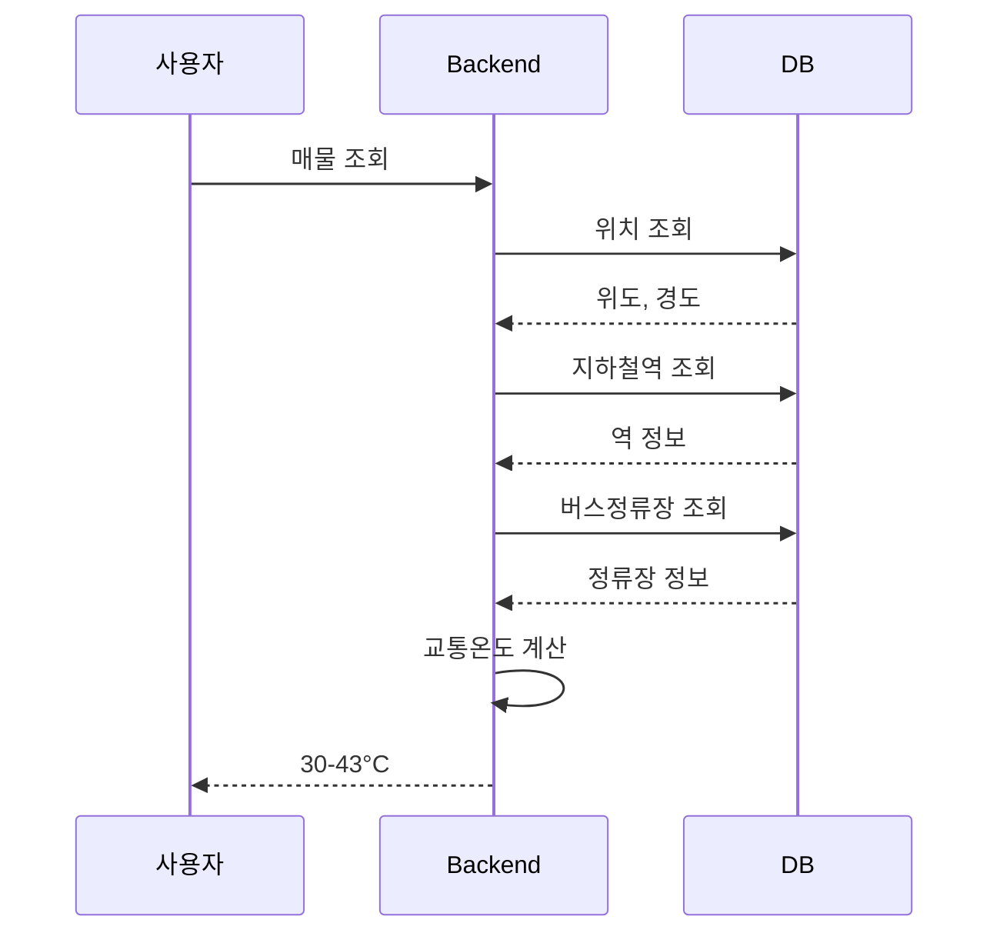

## 2. 공원온도 (30-43°C)

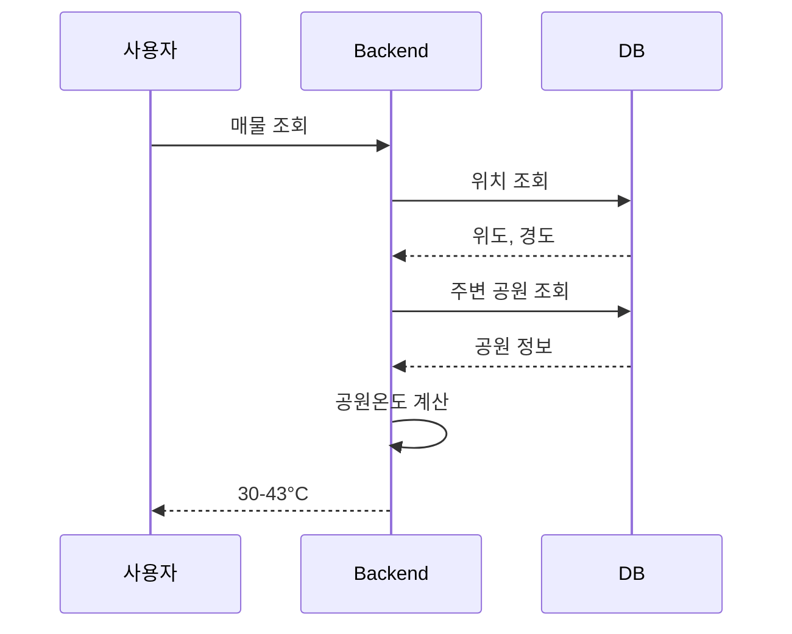

## 3. 편의시설온도 (30-43°C)

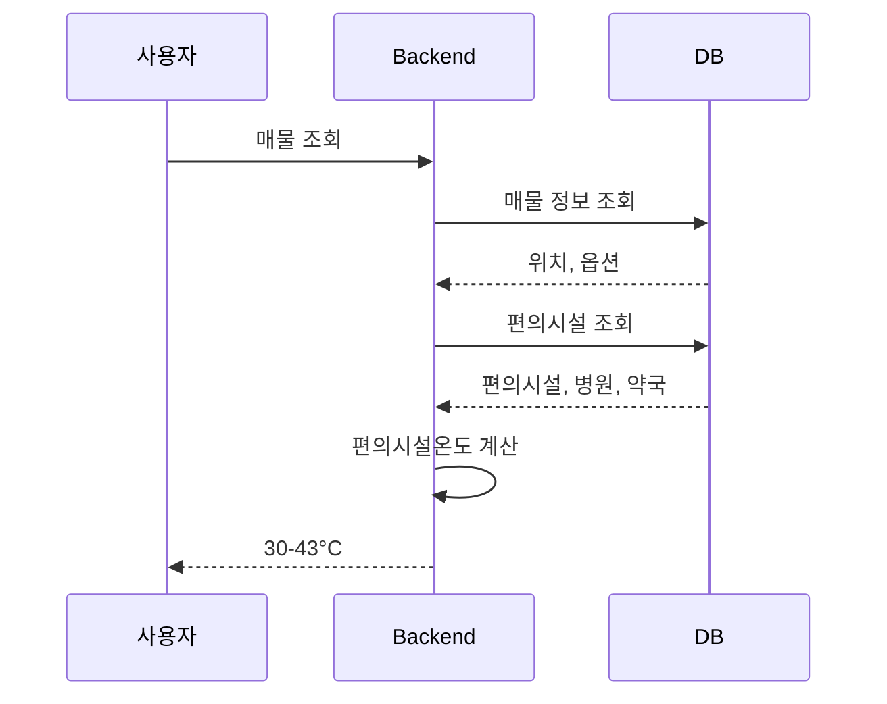

## 4. 안전온도 (30-43°C)

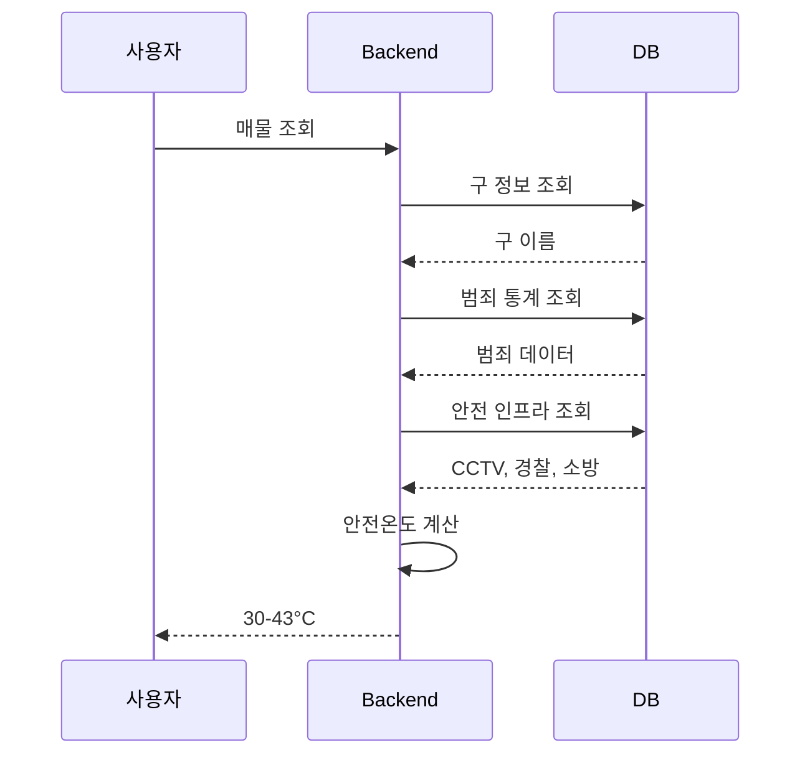

## 5. 허위매물온도 (30-43°C)

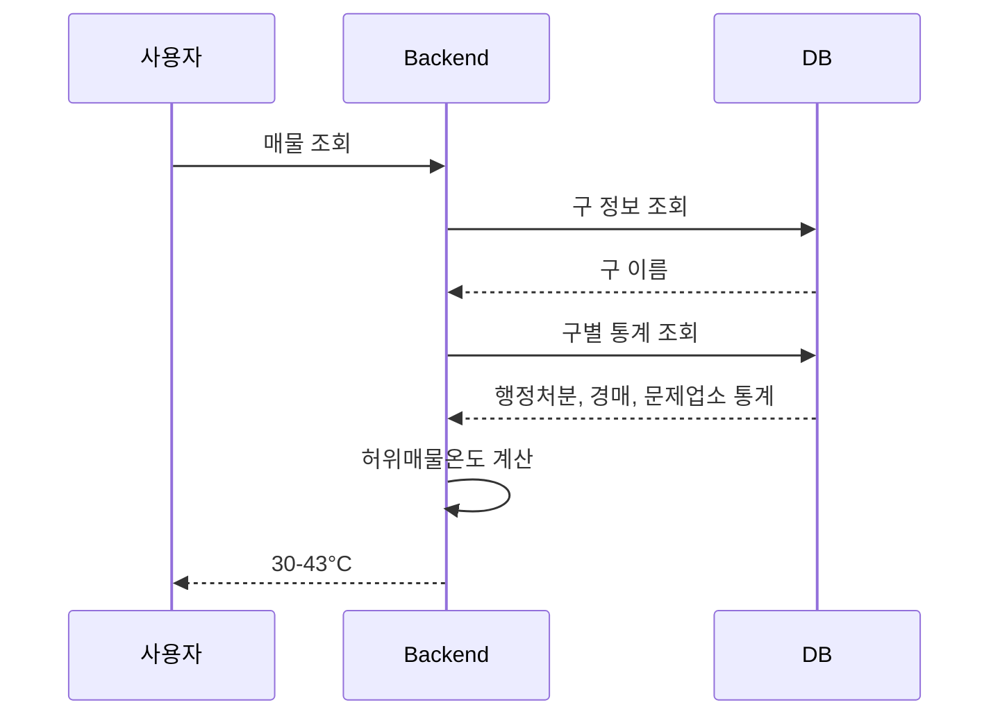

---

## 📊 온도 계산 특징 요약

| 온도 | 계산 주기 | 캐싱 전략 | 주요 데이터 소스 | 계산 복잡도 |
|------|-----------|-----------|------------------|-------------|
| **교통온도** | 실시간 | 1시간 | 지하철역, 버스정류장 | 중간 (거리 계산) |
| **공원온도** | 실시간 | 1시간 | 공원 정보 | 중간 (거리 계산) |
| **편의시설온도** | 실시간 | 1시간 | 편의시설, 병원, 약국 | 높음 (다중 POI) |
| **안전온도** | 일 1회 | 24시간 | 범죄 통계, 안전 인프라 | 낮음 (구 단위) |
| **허위매물온도** | 주 1회 | 7일 | 중개업소, 행정처분, 경매 | 낮음 (구 단위) |

## 🚀 성능 최적화 전략

1. **Redis 캐싱**: 계산된 온도를 캐싱하여 반복 조회 시 성능 향상
2. **병렬 처리**: 5가지 온도를 동시에 계산 (멀티스레딩)
3. **공간 인덱스**: PostgreSQL의 PostGIS 확장으로 거리 계산 최적화
4. **배치 계산**: 안전온도, 허위매물온도는 주기적으로 일괄 계산
5. **CDN 캐싱**: 정적 데이터(구별 통계)는 CloudFront에서 캐싱


---

## 📊 온도 계산 로직 설명

### 1. 교통온도 계산 로직

**입력 데이터**
- 매물 위치 (위도, 경도)
- 주변 지하철역 정보 (거리, 출퇴근 비율, 승하차 수)
- 주변 버스정류장 정보 (거리, 개수)

**계산 과정**

#### 🚇 지하철 점수 (55%)
1. 가까운 역 3개 선택 (반경 2km 내)
2. 각 역의 거리 점수 계산
   - 0-250m: 1.0점 (1차 역세권)
   - 250-500m: 0.5점 (2차 역세권)
   - 500m 이상: 지수 감소 (exp(-거리/500))
3. 각 역의 중요도 점수 계산
   - 출퇴근 비율 40% (출퇴근 시간대 승하차 비중)
   - 역 규모 20% (일일 승하차 인원)
4. 종합 점수 = 거리 점수 × 역 중요도
5. 거리 가중 평균으로 최종 지하철 점수 산출

#### 🚌 버스 점수 (45%)
1. 가장 가까운 정류장까지 거리 계산
2. 거리 점수 (70%): exp(-거리/300)
3. 밀도 점수 (30%): 반경 300m 내 정류장 수 / 8
4. 버스 점수 = 거리 점수 + 밀도 점수

#### 🔄 최종 온도 계산
```
교통 점수 = 지하철 점수 × 0.55 + 버스 점수 × 0.45
정규화 = (점수 - 최소값) / (최대값 - 최소값)
교통온도 = 30 + (정규화 점수 × 13)
```

**결과**: 30-43°C (높을수록 대중교통 편리)

---

### 2. 공원온도 계산 로직

**입력 데이터**
- 매물 위치 (위도, 경도)
- 주변 공원 정보 (면적, 시설, 유형, 거리)

**계산 과정**

#### 🏞️ 공원 품질 점수
1. 크기 점수 (40%): 공원 면적 Min-Max 정규화
   - 최소: 50㎡ → 0점
   - 최대: 6,691,885㎡ (올림픽공원) → 1점
2. 시설 점수 (40%): 5가지 시설 유형 개수 / 5
   - 운동시설, 유희시설, 편익시설, 교양시설, 기타시설
3. 유형 점수 (20%)
   - 근린공원: 1.0점
   - 어린이공원: 0.8점
   - 소공원: 0.7점
4. 공원 품질 = 크기×0.4 + 시설×0.4 + 유형×0.2

#### 📏 거리 점수
1. 반경 800m 내 공원 선택 (없으면 가장 가까운 공원 1개)
2. 거리 점수 = exp(-거리/400)
3. 거리 가중치 = 1 / (1 + 거리/300)
4. 종합 점수 = 공원 품질 × 거리 점수
5. 거리 가중 평균으로 최종 점수 산출

#### 🔄 최종 온도 계산
```
정규화 = (점수 - 최소값) / (최대값 - 최소값)
공원온도 = 30 + (정규화 점수 × 13)
```

**결과**: 30-43°C (높을수록 공원 환경 우수)

---

### 3. 편의시설온도 계산 로직

**입력 데이터**
- 매물 위치 (위도, 경도)
- 매물 옵션 (세탁기, 냉장고, 싱크대, 가스레인지 등)
- 주변 편의시설, 병원, 약국 정보

**계산 과정**

#### 🏠 필요도(Need) 계산
1. 기본 필요도 = 0.7
2. 세탁기 없음 → +0.1 (세탁소 의존도 증가)
3. 부실 주방 → +0.1 (식당/편의점 의존도 증가)
   - 냉장고 없음 OR (싱크대 없음 AND 가스/인덕션 없음)
4. 편의시설 필요도 (최대 1.0)
5. 병원/약국 필요도 = 0.7 (고정)

#### 📍 접근성(Access) 계산
**편의시설 접근성 (반경 800m)**
- 거리 점수 (60%): max(0, 1 - 거리/800)
- 밀도 점수 (40%): min(개수/5, 1.0)

**병원/약국 접근성 (반경 1200m)**
- 거리 점수 (60%): max(0, 1 - 거리/1200)
- 밀도 점수 (40%): min(개수/2, 1.0)

#### 🔄 최종 온도 계산
```
편의시설 점수 = Need × Access
병원 점수 = Need × Access
약국 점수 = Need × Access

총점 = 편의시설 점수 × 0.5 + 병원 점수 × 0.25 + 약국 점수 × 0.25
편의시설온도 = 30 + (총점 × 13)
```

**결과**: 30-43°C (높을수록 생활 편의성 우수)

---

### 4. 안전온도 계산 로직

**입력 데이터**
- 매물이 속한 구 정보
- 구별 범죄 통계 (5대 범죄: 살인, 강도, 강간, 절도, 폭력)
- 구별 안전 인프라 (CCTV, 지구대/파출소, 소방서, 안전비상벨)

**계산 과정**

#### 🚨 범죄 점수 (30%)
1. 5대 범죄 총 발생 건수 집계
2. 서울시 전체 구별 범죄 통계에서 Min-Max 정규화
3. 범죄 점수 = 1 - (발생건수 - 최소) / (최대 - 최소)
   - 범죄가 적을수록 높은 점수 (역수)

#### 🛡️ 안전 인프라 점수 (70%)
1. CCTV 점수 (30%): 생활방범, 차량방범, 어린이보호 CCTV 개수 정규화
2. 경찰 인프라 점수 (20%): 지구대/파출소 개수 정규화
3. 소방 인프라 점수 (10%): 소방서 개수 정규화
4. 안전비상벨 점수 (10%): 안전비상벨 개수 정규화

#### 🔄 최종 온도 계산
```
안전 점수 = 범죄×0.3 + CCTV×0.3 + 경찰×0.2 + 소방×0.1 + 비상벨×0.1
정규화 = (점수 - 최소값) / (최대값 - 최소값)
안전온도 = 30 + (정규화 점수 × 13)
```

**결과**: 30-43°C (높을수록 안전)

---

### 5. 허위매물온도 계산 로직

**입력 데이터**
- 매물이 속한 구 정보
- 구별 통계 데이터 (사전 집계된 데이터)
  - 행정처분 통계 (2017-2024년)
  - 경매 건수 통계
  - 문제업소 비율 통계

**계산 과정**

#### 📊 구별 통계 기반 계산
> 중개업소를 개별 조회하지 않고, 사전에 집계된 구별 통계 데이터를 활용

#### 🏢 문제업소 통계 (30%)
1. 구별 문제업소 비율 통계 조회
   - 문제업소 = 휴업 + 업무정지 + 휴업연장
   - 비율 = 문제업소 / 전체 중개업소 × 100
2. 서울시 전체 구별 비율에서 Min-Max 정규화
3. 역수 처리 (문제업소가 적을수록 높은 점수)

#### ⚖️ 행정처분 통계 (40%)
1. 구별 행정처분 통계 조회
   - 등록취소 × 5점
   - 업무정지 × 3점
   - 적발건수 × 1점
2. 행정처분 비율 = 처분 점수 / 중개업소 수
3. 서울시 전체 구별 비율에서 Min-Max 정규화
4. 역수 처리 (행정처분이 적을수록 높은 점수)

#### 🔨 경매 통계 (30%)
1. 구별 부동산 경매 건수 통계 조회
2. 서울시 전체 구별 경매 건수에서 Min-Max 정규화
3. 역수 처리 (경매가 적을수록 높은 점수)
   - 경매가 많음 = 시장 불안정

#### 🔄 최종 온도 계산
```
신뢰도 점수 = 행정처분×0.4 + 경매×0.3 + 문제업소×0.3
정규화 = (점수 - 최소값) / (최대값 - 최소값)
허위매물온도 = 30 + (정규화 점수 × 13)
```

**특징**
- 구 단위 통계 데이터 활용 (개별 중개업소 조회 불필요)
- 배치 작업으로 사전 집계 (주 1회 업데이트)
- 빠른 조회 성능 (통계 테이블에서 단순 조회)

**결과**: 30-43°C (높을수록 신뢰도 높음, 허위매물 위험 낮음)

---

## 🌡️ 온도 범위 해석

| 온도 범위 | 의미 | 설명 |
|-----------|------|------|
| **30-32°C** | 🥶 매우 부족 | 해당 지표가 매우 낮음 |
| **32-34°C** | 😰 부족 | 해당 지표가 낮음 |
| **34-36°C** | 😐 보통 | 일반적인 서울 주거지 수준 |
| **36-38°C** | 🙂 양호 | 해당 지표가 좋음 |
| **38-40°C** | 😊 우수 | 해당 지표가 매우 좋음 |
| **40-43°C** | 🔥 최우수 | 해당 지표가 최상위 수준 |

**36.5°C = 평균 체온 = "딱 적당한" 기준점**

---

## 🎯 온도 활용 방법

### 사용자 선호도 기반 추천
```
종합 점수 = 교통온도 × w1 + 공원온도 × w2 + 편의시설온도 × w3 + 
           안전온도 × w4 + 허위매물온도 × w5

w1 + w2 + w3 + w4 + w5 = 1.0
```

**예시**
- 직장인: 교통온도 40%, 편의시설온도 30%, 나머지 10%씩
- 가족: 공원온도 30%, 안전온도 30%, 교통온도 20%, 나머지 10%씩
- 1인가구: 편의시설온도 40%, 교통온도 30%, 나머지 10%씩

### 매물 비교
- 5가지 온도를 레이더 차트로 시각화
- 온도별 색상 코딩 (파란색 → 빨간색)
- 사용자 선호도에 따른 종합 점수 순위

### 필터링
- 특정 온도 이상인 매물만 표시
- 예: "교통온도 38°C 이상, 안전온도 36°C 이상"


---

## 🌡️ 온도 계산 시스템 플로우 다이어그램

### 교통온도 (30-43°C)

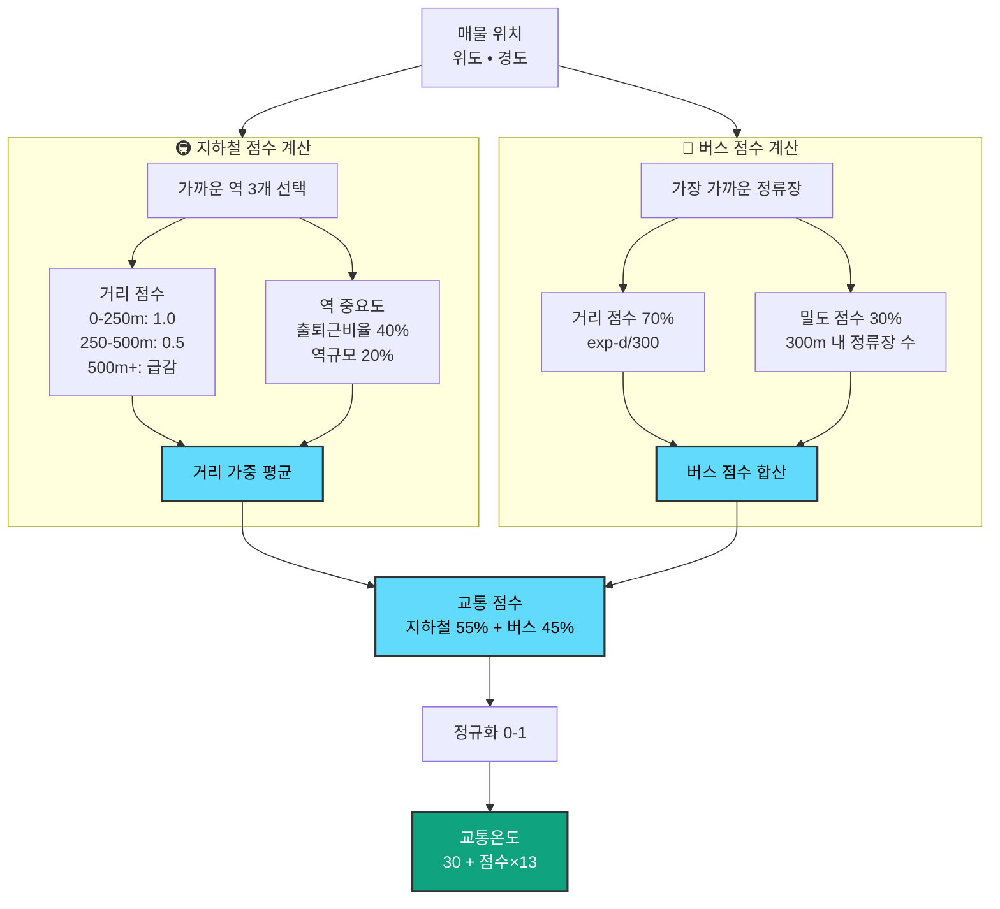

### 공원온도 (30-43°C)

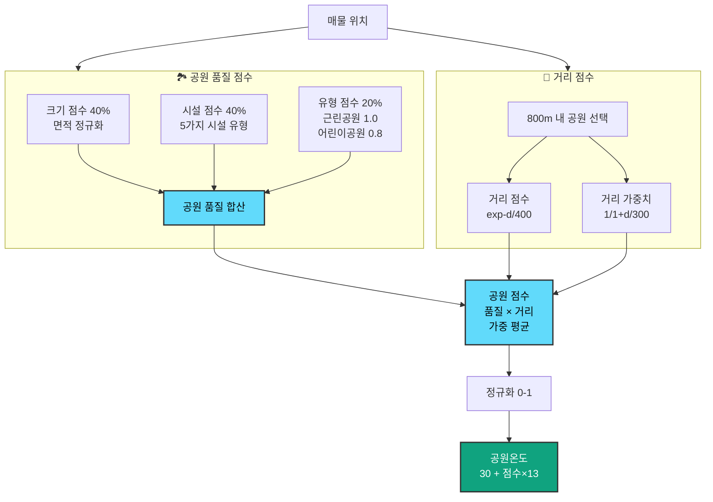

### 편의시설온도 (30-43°C)

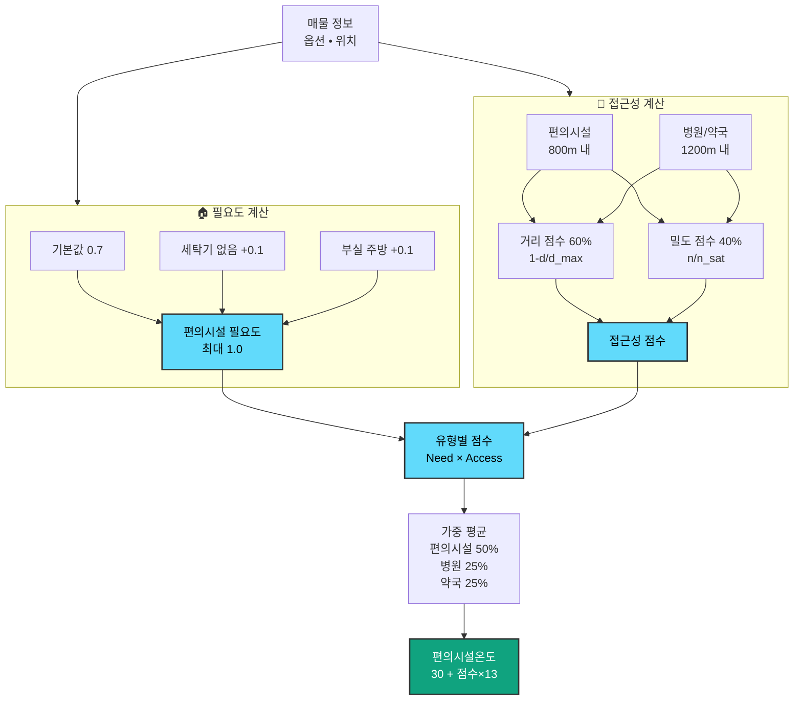

### 안전온도 (0-100점)

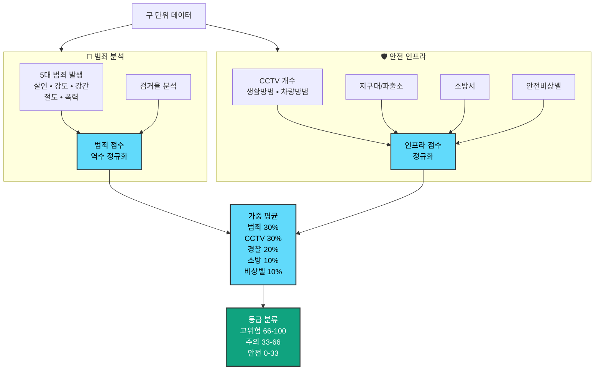

### 허위매물온도 (0-100점)

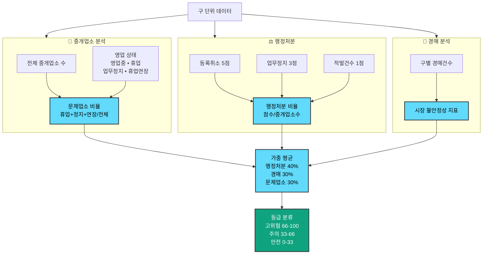

### 온도 통합 시스템

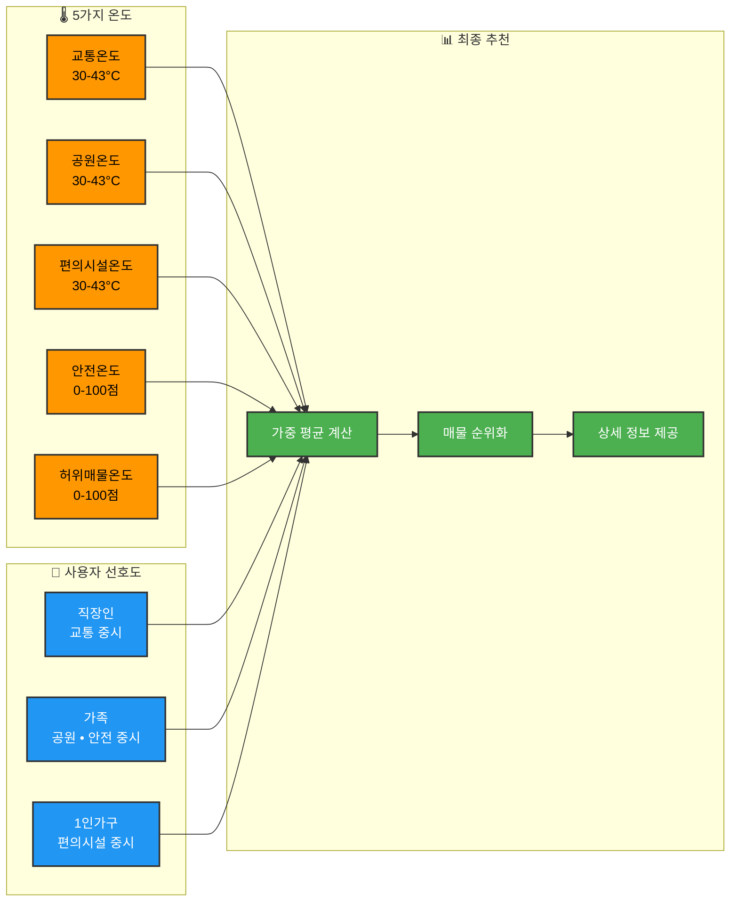

## 📊 온도별 특징 비교

| 온도 | 범위 | 계산 단위 | 주요 요소 | 활용 |
|------|------|-----------|-----------|------|
| **교통온도** | 30-43°C | 매물별 | 지하철 거리/중요도, 버스 거리/밀도 | 출퇴근 편의성 |
| **공원온도** | 30-43°C | 매물별 | 공원 크기/시설/유형, 거리 | 주거 환경 쾌적성 |
| **편의시설온도** | 30-43°C | 매물별 | 매물 옵션, 편의시설/병원/약국 접근성 | 생활 편의성 |
| **안전온도** | 0-100점 | 구별 | 범죄 발생, CCTV, 경찰/소방 인프라 | 치안 안전성 |
| **허위매물온도** | 0-100점 | 구별 | 행정처분, 경매, 문제업소 비율 | 거래 신뢰성 |
