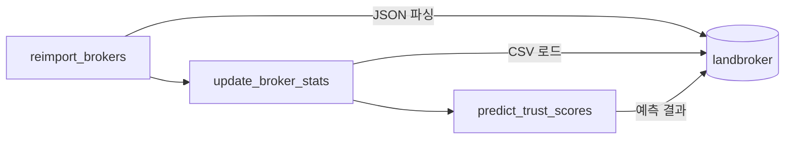

# 🏠 중개사 신뢰도 등급 Import 스크립트

중개사 데이터를 DB에 적재하고 신뢰도 등급(A/B/C)을 예측하는 스크립트 모음입니다.

## 📁 파일 구조

```
scripts/03_import/trust/
├── import_trust_all.py      # 통합 실행 스크립트
├── reimport_brokers.py      # 1단계: 중개사 기본 정보 Import
├── update_broker_stats.py   # 2단계: 통계 정보 업데이트
└── predict_trust_scores.py  # 3단계: 신뢰도 등급 예측
```

---

## 📋 각 파일 설명

### 1️⃣ `reimport_brokers.py`
**크롤링 JSON에서 중개사 기본 정보 추출 → DB 저장**

| 입력 | `/data/RDB/land/*.json` (크롤링 데이터) |
|------|----------------------------------------|
| 출력 | `landbroker` 테이블 INSERT/UPDATE |

**저장 필드:** 사무소명, 대표자, 전화번호, 주소, 등록번호

---

### 2️⃣ `update_broker_stats.py`
**V-World API CSV에서 통계 정보 추출 → DB 업데이트**

| 입력 | `/data/brokerInfo/grouped_offices.csv` |
|------|---------------------------------------|
| 출력 | `landbroker` 테이블 UPDATE |

**업데이트 필드:** 거래완료, 등록매물, 공인중개사수, 중개보조원수, 등록일

---

### 3️⃣ `predict_trust_scores.py`
**학습된 ML 모델로 신뢰도 등급 예측 → DB 저장**

| 입력 | `landbroker` 테이블 + `/data/trust_model/final_trust_model.pkl` |
|------|-----------------------------------------------------------------|
| 출력 | `landbroker.trust_score` (A/B/C) UPDATE |

**사용 Feature (14개):**
- 등록매물, 거래활동량, 1인당 거래량 (로그 변환)
- 직원수, 중개보조원 비율, 자격증 보유비율
- 운영기간, 숙련도 지수, 운영 안정성
- 대형사무소, 대표자 자격 등

---

### 4️⃣ `import_trust_all.py`
**위 3개 스크립트를 순차 실행하는 통합 스크립트**

```
reimport_brokers → update_broker_stats → predict_trust_scores
```

---

## 🚀 실행 방법

### 전체 실행 (권장)
```bash
docker compose --profile scripts run --rm scripts python 03_import/trust/import_trust_all.py
```

### 개별 실행
```bash
# 중개사 Import만
docker compose --profile scripts run --rm scripts python 03_import/trust/import_trust_all.py --import-only

# 통계 업데이트만
docker compose --profile scripts run --rm scripts python 03_import/trust/import_trust_all.py --stats-only

# 등급 예측만
docker compose --profile scripts run --rm scripts python 03_import/trust/import_trust_all.py --predict-only
```

---

## 🔄 실행 순서



| 순서 | 스크립트 | 필수 여부 |
|------|----------|----------|
| 1 | reimport_brokers.py | ✅ 필수 (기본 정보) |
| 2 | update_broker_stats.py | ✅ 필수 (통계 정보) |
| 3 | predict_trust_scores.py | ✅ 필수 (등급 예측) |

> ⚠️ **2단계 통계 정보가 있어야 3단계 예측이 정확함**

---

## 📊 결과 확인

```sql
-- PostgreSQL에서 결과 확인
SELECT trust_score, COUNT(*) 
FROM landbroker 
GROUP BY trust_score;
```

예상 결과:
```
 trust_score | count
-------------+-------
 A           |   206
 B           |    87
 C           |   152
```
